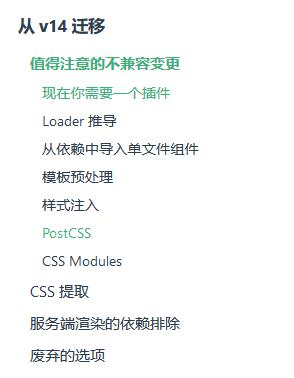

## vue-loader 使用记录


1. webpackvue-loader was used without the corresponding plugin. Make sure to include VueLoaderPlugin

新建新项目配置`vue-loader`打包`vue`后发现报错。


```
ERROR in ./src/header.vue
Module Error (from ./node_modules/_vue-loader@15.9.0@vue-loader/lib/index.js):
vue-loader was used without the corresponding plugin. Make sure to include VueLoaderPlugin in your webpack config.
 @ ./src/index.js 4:0-33
```

查阅文档发现v15版的`vue-loader`配置需要加个`VueLoaderPlugin`。

```
"devDependencies": {
    "vue": "^2.6.10",
    "vue-loader": "^15.9.0",
    "vue-template-compiler": "^2.6.11"
  }
```

解决方案1：把vue-loader回到v14版本（但是不推荐）

```
npm uninstall vue-loader
npm install vue-leader@14.2.2
```

解决方案2：修改`webpack.config.js`

```
const path = require('path');
// 查阅文档发现v15版的vue-loader配置需要加个VueLoaderPlugin
// 并且不设置 VueLoaderPlugin 的话打包会报错提示需要设置 VueLoaderPlugin 对象
const VueLoaderPlugin = require('vue-loader/lib/plugin');

module.exports = {
	mode: 'development',
	// entry: './src/index.js',
	entry: {
		main: './src/index.js'
	},
	output: {
		filename: 'bundle.js',
		// path 不写其实也可以，默认就会打包到 dist 目录
		path: path.resolve(__dirname, 'dist')
	},
	plugins:[
		new VueLoaderPlugin()
	],
	module: {
	    rules: [
			{
				test: /\.vue$/,
				use: {
					loader: 'vue-loader'
				}
			}
		]
	}
}
```



