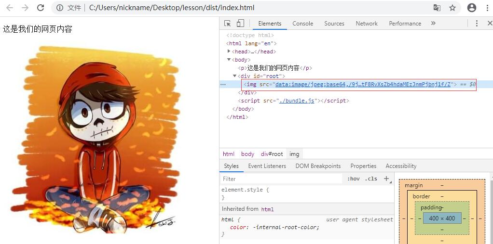

## 05 使用 Loader 打包静态资源（图片篇）

> 前言：同学们大家好上节课我们给大家讲解了`loader`的作用，也带大家使用了`file-loader`，这节课我们继续在讲解下图片打包的事情。

[->file-loader](https://www.webpackjs.com/loaders/file-loader/)

[->url-loader](https://www.webpackjs.com/loaders/url-loader/)

lesson

```
dist
  |--bd7a45571e4b5ccb8e7c33b7ce27070a.jpg （很长的一个名字）
  |--bundle.js
  |--index.html
src
  |--avatar.jpg
  |--header.vue
  |--index.js
index.html
package.json
webpack.config.js
```

#### placeholder 占位符

上节课我们看我们的图片的名字实际上被打包成了一个比较长的字符串，咱们来看当你在做`index.js`打包的时候在`dist`目录下图片被打包成了一个很长的这样的一个字符串如果我们想不变动图片的名字怎么办？现在图片的名字时`avatar.jpg`
我希望呢图片的名字不变打包出的图片也是`avatar.jpg`。

好这个时候我们就要对`loader`做一些额外的配置了我们打开`webpack.config.js`这个文件，然后我们来看：


```
const path = require('path');

module.exports = {
	mode: 'development',
	// entry: './src/index.js',
	entry: {
		main: './src/index.js'
	},
	output: {
		filename: 'bundle.js',
		// path 不写其实也可以，默认就会打包到 dist 目录
		path: path.resolve(__dirname, 'dist')
	},
	module: {
		rules: [
			{
				test: /\.jpg$/,
				use: {
					loader: 'file-loader'
				}
			}
		]
	}
}
```

这里我们做了配置当遇到一个`.jpg`图片的时候我们使用`file-loader`，那其实在使用`loader`的时候我们可以配置一些额外的参数，这些参数我们可以额外的放到一个名字叫做`options`的配置项里面，这个配置项里面呢我们就可以写一些内容，比如说：我希望我打包生成的文件的名字它的形式是什么，它的形式跟之前图片的名字一模一样然后呢后缀也一模一样，大家看这句话的意思就是我新打包出来的图片的名字是什么，是那张图片本身的名字和图片的后缀，那么当我们配置了这个`options`之后我们把`dist`目录删除掉，重新打包：


```
{
	test: /\.jpg$/,
	use: {
		loader: 'file-loader',
		options: {
		    name: '[name].[ext]'
		}
	}
}
```

重新打包`npm run bundle`：

```
C:\Users\nickname\Desktop\lesson>npm run bundle

> webpack-demo@1.0.0 bundle C:\Users\nickname\Desktop\lesson
> webpack


C:\Users\nickname\Desktop\lesson>"node"  "C:\Users\nickname\Desktop\lesson\node_modules\.bin\\..\_webpack@4.41.6@webpack\bin\webpack.js"
Hash: 39456c7e17b6295ab80e
Version: webpack 4.41.6
Time: 583ms
Built at: 2020-02-14 09:29:23
     Asset      Size  Chunks             Chunk Names
avatar.jpg  19.3 KiB          [emitted]
 bundle.js  15.5 KiB    main  [emitted]  main
Entrypoint main = bundle.js
```

我们来看下打包出的文件：

lesson

```
dist
  |--avatar.js
  |--bundle.js
  |--index.html
```

在`dist`目录下是不是这个时候打包出的文件就是`avatar.jpg`了，那么这种配置的语法我们管他叫做`placeholder`占位符，其实呢这个`file-loader`对应的占位符有很多个我们呢可以打开`webpack`的官网来看一看 [file-loader](https://www.webpackjs.com/loaders/file-loader/)，在`file-loader`的文档中大家往下去翻在下面大家可以看到这里就有占位符，刚才我们用到了`[ext]`表示的是原始文件的后缀、`[hash]`表示的是打包出来的这个文件图片的hash值，这样的话呢大家就应该知道这个`placeholder`它大致的意思了，也就是当你打包一个`.jpg`图片的时候我希望你打包出的图片的名字跟原始文件的名字
基本上保持一致。

```
{
	test: /\.jpg$/,
	use: {
		loader: 'file-loader',
		options: {
			// placeholder 占位符
			// name: '[name]_[hash].[ext]'
			name: '[name].[ext]'
		}
	}
}
```

```
name: '[name]_[hash].[ext]'
```

在原始文件的名字后面在加一个这次打包的`hash`值然后呢在加一个`[ext]`后缀，这个后缀其实就是这个test里配置的`.jpg`这个字符串。


好现在呢，我们打包的时候只能打包`.jpg`这样的图片，其实图片还有很多其它的种类，我们可以在`test`配置里面给它补上：

当你这样配置好了之后，这是一个正则表达式，那一旦文件的结尾是`jpg`或者`png`或者`gif`的话都会使用`file-loader`进行打包。

```
test: /\.(jpg|png|gif)$/,
```

---

#### outputPath  打包输出路径

好，接着呢我们在去想一个情况，我们现在呢图片打包到哪里去了，打包到`dist`目录的根目录下，但有的时候呢我希望怎么办呢？我希望打包这个图片的时候图片能够被打包到一个名字叫做`img`的这样一个文件夹里面，那怎么办？我们在这里可以在配置一个参数，叫做`outputPath`这里呢我们可以写一个`images/`它的意思就是当我遇到`.jpg`、`.png`、`.gif`这样的文件的时候我打包的时候会把这个文件打包生成到`dist`目录下的`images`这个文件夹里，那我们实验一下：

重新打包：
```
C:\Users\nickname\Desktop\lesson>npm run bundle
```

lesson

```
dist
 |--images
      |--avatar.jpg
 |--bundle.js
 |--index.html
```

然后我们来看`dist`文件夹的目录下面多了一个`images`这样的一个文件夹下面呢把图片打包到了这里，那么我们接下来来看下这个页面能否正确的运行啊？大家可以看到这个时候这张图片依然可以正确的显示，就说明打包呢没有任何问题。

其实呀`file-loader`的参数非常多，大家在真正的业务场景中还会遇到很多图片或者文件打包的问题，这个时候呢如果你不知道该怎么处理的时候你就打包`file-loader`的文档进入`DOCUMENTATION` （文档）找到`LOADERS`里面的`file-loader`这个`loader`，在这里文档里面详细的列举了`file-loader`每一个参数参数的使用，它的`options`还可能会有`context`、`emitFile`这样其它的参数，那你可以看一下这些参数，然后呢根据这些参数说明来帮助你逐步解决其它业务中的问题。

`file-loader`呢主要的内容其实已经给大家介绍过了，那这里呢就不再往下更细化的介绍了。

#### url-loader

[->url-loader](https://www.webpackjs.com/loaders/url-loader/)

说完`file-loader`呢我们在说一个和`file-loader`很类似的`loader`，叫做`url-loader`，大家可以在`webpack`的官网在`LOADERS`左侧的列表树里面找到`url-loader`这个`loader`。

那`url-loader`除了能做`file-loader`的工作之外它还能做一个额外的事情，我们呢现在一起来尝试使用一下`url-loader`。

首先我们在配置文件里面做一些变更，好打开`webpack.config.js`：

webpack.config.js

```
{
	test: /\.(jpg|png|gif)$/,
	use: {
		loader: 'url-loader',
		options: {}
	}
}
```

这个时候呢我不用`file-loader`了，刚才我说有一个`loader`叫做`url-loader`它呢完全可以实现`file-loader`所实现的一切功能，所以在这里我改成了`url-loader`，但是你要使用这个`loader`打包可以嘛，大家可以看到它报了错误说说明呀我并没有安装这个`url-loader`，所以呢我要先运行`npm install url-loader -D`：


```
C:\Users\nickname\Desktop\lesson>cnpm install url-loader -D
```

重新打包`npm run bundle`：

```
C:\Users\nickname\Desktop\lesson>npm run bundle

> webpack-demo@1.0.0 bundle C:\Users\nickname\Desktop\lesson
> webpack


C:\Users\nickname\Desktop\lesson>"node"  "C:\Users\nickname\Desktop\lesson\node_modules\.bin\\..\_webpack@4.41.6@webpack\bin\webpack.js"
Hash: 2dfae9e49b279553b9ba
Version: webpack 4.41.6
Time: 700ms
Built at: 2020-02-14 10:41:48
    Asset      Size  Chunks             Chunk Names
bundle.js  41.3 KiB    main  [emitted]  main
Entrypoint main = bundle.js
```

能不能正确的打包呢，大家可以看到完全OK，然后在到我们的`dist`目录下看只有一个`bundle.js`了，但是有一个问题图片有没有是不是没有被打包到`dist`目录下呀，这很奇怪然后呢我们在浏览器上看一下`index.html`大家可以看到我图片没有被打包到`dist`目录下但是在`index.html`里面能不能显示出图片的内容啊，这是不是就很奇怪，到底是怎么回事呢？我们打开`bundle.js`往下去翻：

大家可以看到这里打包成的`bundle.js`里面有一个`eval`这样的执行语句，里面呢有一个`base64`的文件，大家可以看到这个`base64`非常的长。


```
/***/ (function(module, __webpack_exports__, __webpack_require__) {

"use strict";
eval("__webpack_require__.r(__webpack_exports__);\n/* harmony default export */ __webpack_exports__[\"default\"] = (\"data:image/jpeg;base64,/9j/4AAQSkZJRgABAQAAAQABAAD/2wBDAAkGBwgHBgkICAgKCgkLDhcPDg0NDhwUFREXIh4jIyEeICAlKjUtJScyKCAgLj8vMjc5PDw8JC1CRkE6RjU7PDn/
......
```



我们在浏览器的控制台里可以看到这张图片并不是引入一个外部的地址而是一个`base64`的一个内容，这是怎么回事啊，我来给大家讲解一下:

当你去打包一个`.jpg`图片的时候我用了`url-loader`，这个时候`url-loader`会怎么样它和`file-loader`不一样它会把你的图片转换成呢一个`base64`的字符串然后直接放到你的`bundle.js`里面而不是单独生成一个图片文件，所以`url-loader`它是这样一个`loader`。

但是这个`loader`如果是这么用实际上是不合理的我们想一下啊你这么去打包带来了几个好处，最重要的一个好处就是我图片打包到`js`里面那么实际上加载好了`js`文件页面就出来了它不用在额外的去请求一个图片的地址了减少了一次`http`请求。

但是带来的问题是什么呢？

如果这个文件特别的大，打包生成的`js`文件也就会特别的大那么你加载这个`js`的时间就会很长，所以在开始很长的时间里面页面上什么东西都显示不出来，所以这个`url-loader`最佳的一个使用方式是什么？

##### `url-loader`最佳的一个使用方式是什么？

我们呢如果一个图片非常的小， 比如说：1KB或者2KB，那么这个图片以`base64`
的形式打包到`.js`的文件里是一个非常好的选择，没必要让这个`1KB`、`2KB`的图片在去发一个`http`请求了，那假设这个图片很大的话那么你就像`file-loader`一样把这个图片打包到`dist`目录下不要打包到`bundle.js`里这样更合适，因为这样可以让`bundle.js`快速的加载完成页面可以快速的显示出来，不然的话`bundle.js`会一下子变的很大那加载它时间很长页面很久才能显示出来。

##### 要想实现这种最佳实践该怎么办？

其实非常的简单，在`options`里面我们在配置一个参数叫做`limit`，这里我们可以写一个`2048`，它的意思是呢，如果你的图片的大小超过了`2048`个字节的话那么我就会像`file-loader`一样给它打包到`dist`目录下生成一个图片，但是如果你图片小于`2048`个字节也就是小于2kb的时候，那么我会直接把这个图片变成一个`base64`的字符串放到`bundle.js`里面。


webpack.config.js

```
const path = require('path');
// 查阅文档发现v15版的vue-loader配置需要加个VueLoaderPlugin
// 并且不设置 VueLoaderPlugin 的话打包会报错提示需要设置 VueLoaderPlugin 对象
const VueLoaderPlugin = require('vue-loader/lib/plugin');

module.exports = {
	mode: 'development',
	// entry: './src/index.js',
	entry: {
		main: './src/index.js'
	},
	output: {
		filename: 'bundle.js',
		// path 不写其实也可以，默认就会打包到 dist 目录
		path: path.resolve(__dirname, 'dist')
	},
	plugins:[
		new VueLoaderPlugin()
	],
	module: {
		rules: [
			{
				test: /\.jpg$/,
				/* use: {
					loader: 'file-loader',
					options: {
						// placeholder 占位符
						// name: '[name]_[hash].[ext]'
						name: '[name].[ext]',
						outputPath: 'images/'
					}
				} */
				use: {
					loader: 'url-loader',
					options: {
						name: '[name].[ext]',
						outputPath: 'images/',
						// 字节
						limit: 2048
					}
				}
			},
			{
				test: /\.vue$/,
				use: {
					loader: 'vue-loader'
				}
			}
		]
	}
}
```

示例：

图片`avatar.jpg`的大小是`20kb`，我在`webpack.config.js`中配置的`limit`是`10240`字节，那么我的图片`20kb`是大于我配置的`10240`字节的，这样图片就不会以`base64`的形式被打包到`bundle.js`中。

重新打包`npm run bundle`：

```
C:\Users\nickname\Desktop\lesson>npm run bundle

> webpack-demo@1.0.0 bundle C:\Users\nickname\Desktop\lesson
> webpack


C:\Users\nickname\Desktop\lesson>"node"  "C:\Users\nickname\Desktop\lesson\node_modules\.bin\\..\_webpack@4.41.6@webpack\bin\webpack.js"
Hash: 95638e4654149f2ba004
Version: webpack 4.41.6
Time: 637ms
Built at: 2020-02-14 14:32:02
            Asset      Size  Chunks             Chunk Names
        bundle.js  15.6 KiB    main  [emitted]  main
images/avatar.jpg  19.3 KiB          [emitted]
Entrypoint main = bundle.js
```

我们可以在打包输出中看到`avatar.jpg`已经打包到`dist`目录中的`images`文件夹里面去了。

---


### 总结

其实`url-loader`和`file-loader`非常的类似，只不过它多了一个`limit`的配置项，那假设你打包的图片大于这个`limit`的值的时候，它会和`file-loader`一模一样把这个图片挪到`dist`目录下，那假如你的图片小于这个`limit`的值，那么它会把这个图片直接以`base64`的形式打包到`js`文件里面，好讲到这呢，我就带大家完整的使用了`file-loader`和`url-loader`来处理图片文件的打包，那么实际上我们只用了这两个`loader`的部分配置参数，还有很多参数呢我们没有用到，但是那些参数呢一般是一些不太常用的参数，大家呢如果遇到问题在到官网查就好了。


### 作业

最后呢我给大家留一个作业，大家呢回去自己呢一定要把`webpack`官网上`file-loader`和`url-loader`这两个`loader`的详细介绍自己仔细的来读一遍。
