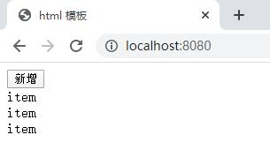
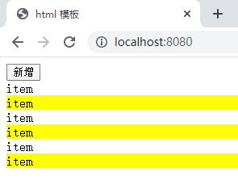
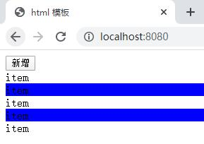
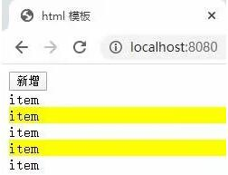

13 Hot Module Replacement 热模块更新（1）

> 前言：同学们大家好，这节课我来给大家讲解`webpack`中的`Hot Module Replacement`这样的一个知识点，它呢中文名字叫做`热模块替换`，很多时候我们也把它简写称为`HMR`，那我们一起通过例子来学习一下到底什么是`HMR`。

[GUIDES 指南 -> 模块热替换(hot module replacement)](https://www.webpackjs.com/guides/hot-module-replacement/)

[API -> 模块热替换(hot module replacement)](https://www.webpackjs.com/api/hot-module-replacement/)

[CONCEPTS 概念 -> 模块热替换(hot module replacement)](https://www.webpackjs.com/concepts/hot-module-replacement/)


#### devServer配置 hot: true和hotOnly: true的配置打开`HMR`

首先我们打开之前`webpack`的这个`lesson`项目，我把`webpack.config.js`中的配置稍微做写更改。

找到我们之前的这个`package.json`文件，这次我们用里面的`npm run start`命令来给大家讲解这节课的内容。

进入到`webpack.config.js`这里面我们在来看一下啊，其它的配置项没什么问题我们在增加一个配置，在这里我们只支持`sass`文件的引入，我呢可以支持一个`css`文件的引入：

```
module: {
    rules: [
        {
        test: /\.scss$/,
        use: [
          "style-loader",
          // "css-loader",
          {
            loader: "css-loader",
            options: {
              importLoaders: 2
              // modules: true
            }
          },
          "sass-loader",
          "postcss-loader"
        ]
       },
       {
        // 把这里改成 css，然后呢我们只使用 style-loader和 css-loader 就可以了，其实的 sass-loader 我们可以不用。
        test: /\.css$/,
        use: [
          "style-loader",
          "css-loader",
          "postcss-loader"
        ]
       }
  ]
}
```

好，写完了之后呢我们到`src`目录下，来编写一些代码，打开index.js`：

<font color=#0099ff size=3 >（下面的代码都会在`npm run start` 服务器打开的情况下运行）</font>

index.js

（这里我们使用 ES5 的代码，因为我们还没使用 Babel 来转义代码）

```
var btn = document.createElement('button')
btn.innerHTML = '新增'
document.body.appendChild(btn)
btn.onclick = function(){
    var div = document.createElement('div');
    div.innerHTML = 'item'
    document.body.appendChild(div)
}

```

这段代码它实现了一个什么功能呢，我们到页面上来看：



有一个叫`新增`的按钮，点击一次就会增加一个`item`，就是这样一个简单的功能
。

那下面呢我想实现一个样式的功能效果，我会想在偶数的这个`item`上面给它加一个背景，那怎么做呢？

index.js

（引入一个`style.css`的样式文件，这就是为什么在上面增加了一个`css`文件的解析）

```
import './style.css'

var btn = document.createElement('button')
btn.innerHTML = '新增'
document.body.appendChild(btn)
btn.onclick = function(){
    var div = document.createElement('div');
    div.innerHTML = 'item'
    document.body.appendChild(div)
}

```

style.css

```
div:nth-of-type(odd){
    background-color: yellow;
}
```

我们在浏览器页面上查看下效果，偶数的`item`它的背景色都是黄色：



现在呢我把`style.css`样式文件修改下，我改成`blue`蓝色，保存然后`webpack-dev-server`的服务器会自动帮我们进行打包。

```
div:nth-of-type(odd){
    /* background-color: yellow; */
    background-color: blue;
}
```

大家看啊这个时候`webpack-dev-server`会干一件事情，它发现你代码改变了之后
呢就会重新帮你打包，重新帮你刷新浏览器，那重新刷新浏览器就会导致我页面上这些`item`项都没有了，我把样式修改为蓝色之后我想在测试就需要重新点击这个`新增`按钮，在来看确实现在蓝色了：



然后这个时候我又改了，改成了`purple`紫色。

```
div:nth-of-type(odd){
    /* background-color: yellow; */
    /* background-color: blue; */
    background-color: purple;
}
```

好，然后我想测试怎么办呢，你又得重新点来测试，这样的话就很麻烦。

于是我就想我希望什么呢，我希望改变样式代码的时候你不要去帮我刷新页面，你只是把样式代码给替换掉就行了，页面上的这些之前渲染出的内容你不要动。

这个时候我们就可以借助`Hot Module Replacement`帮我们实现我们的效果：

下面我们来看怎么通过`Hot Module Replacement`来简化我们的这个流程。

打开`webpack.config.js`这个文件，首先呢要想使用`Hot Module Replacement`
我们要做这样的一个配置：

webpack.config.js

```
devServer: {
    contentBase: './dist',
    open: true,
    hot: true,
    hotOnly: true
}
```

增加一个`hot: true`的配置项，它的意思是呢让我们的`webpack-dev-server`开启`Hot Module Replacement`这样的一个功能，然后呢顺带着一般我也会配一个`hotOnly: true`这个你可以怎么理解呢，你可以这么理解即便是`Hot Module Replacement`的功能没有生效，我也不让浏览器自动的重新刷新。

好，如果你想实现即使`HMR`不生效浏览器也不自动刷新的这个功能，你要把`hotOnly`给它配置成`true`。

这样的话我们的这个`devServer`的配置就完成了。

接着我们要引入一个插件，这是`webpack`自带的一个插件，所以我们呢先引入`require('webpack')`，然后我们到下面的`plugins`配置项里面去填写一个新的插件
`webpack.HotModuleReplacementPlugin()`这样的话就可以了。

webpack.config.js

```
const webpack = require('webpack')

module.exports = {
  mode: "development",
  // entry: './src/index.js',
  entry: {
    main: "./src/index.js"
  },
  output: {
    filename: '[name]-[chunkhash:8].js',
    path: path.resolve(__dirname, "dist")
  },
  devServer: {
    contentBase: './dist',
    open: true,
    hot: true,
    hotOnly: true
  },
  plugins: [
    new webpack.HotModuleReplacementPlugin()
  ]
}
```

当你在`devServer`中配置了`hot: true`和`hotOnly: true`这两项之后，同时使用了`webpack.HotModuleReplacementPlugin()`这个插件之后我们`webpack`里面的这个`HMR`功能就开启了。

##### 那我们看下`HMR`能解决什么样的问题。

当我们改变了`webpack`的配置之后呢，我建议大家一定要重启下你的命令，不然的话它有可能还是按照或者说呢它一定是按照之前的这个配置项来执行的，只有你重启一次之后新的这个配置文件才会生效。

重启命令：

```
C:\Users\nickname\Desktop\lesson_3>npm run start
```

好我们现在在页面上点击`新增`，现在的`item`的背景色是蓝色的：


当然现在我们已经开启了`HMR`这样的功能，然后我在把`style.css`改成`yellow`：

style.css

```
div:nth-of-type(odd){
    background-color: yellow;
    /* background-color: blue; */
}
```

保存，我们再到页面上看一下，大家可以看到`css`文件做了修改，但是它呢不会去影响之前我们`js`对页面上变更，也就是什么，之前我操作创建的这些`item`它依然存在你改了css文件那么我只会去替换页面的`css`内容，我不会改你之前`js`渲染出的内容，这样的话我再做样式调试的时候就方便多了。




这样的话大家知道当我们使用`HMR`这个功能的时候，它的好处是什么呢？

- 第一点好处是：它可以在我们写 css 的时候，方便我们调试 css 。
 