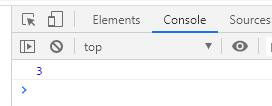

18 Development 和 Production 模式的区分打包

> 前言：这节课呢我来给d大家讲解`Webpack`中 Develoment 和 Production 模式的区分打包。

Mode 的内置函数功能

选项 | 描述
---|---
development | 设置`process.env.MODE_ENV`的值为`development`. 开启`NamedChunksPlugin`和`NamedModulesPlugin`.
production | 设置`process.env.MODE_ENV`的值为`production`. 开启`FlagDependencyUsagePlugin`、`FlagIncludedChunksPlugin`、`ModuleConcatenationPlugin`、`NoEmitOnErrorsPlugin`、`OccurrenceOrderPlugin`、`SideEffectsFlagPlugin`和`TerserPlugin`.
none | 不开启任何优化选项

那在项目的开发过程中呢其实我也给大家讲了我们呢其实有两个模式`develoment`模式和`production`模式它们分别用来做什么呢？

当我们在开发一个项目的时候我们一般用`development`这个环境进行项目的开发在这个打包环境下`Webpack`中我们使用了`webpack-dev-server`可以帮我们起一个服务器然后呢这个服务器里面还集成了一些比如说: `Hot Module Replacement`这样的特性只要我更改了代码它会帮我重新打包然后我们代码的内容会实时的展示在服务器对应的这个网页上，所以呢在开发环境下我们使用`development`这种模式非常的方便。

但是一旦我们的源代码开发完成了我们需要把代码打包上线，这个时候呢就需要用`production`这种模式，那`develoment`模式和`production`模式差异主要在几个方面：

- 首先在开发环境中`Source Map`它是非常全的这样的话呢可以帮我们在开发环境下快速的定位代码的问题，但是在`production`环境下我们说代码已经要上线了，那么`Source Map`其实已经不是那么重要了所以这个时候在线上环境下一般它的`Source Map`会更加简洁一些或者呢在线上环境下`Source Map`我们可以生成一个`.map`文件来进行存储。

- 另外一点是什么，在开发环境下我们的代码一般打包生成之后啊不需要做压缩因为在开发环境下我们希望代码不压缩可以看到打包生成代码的内容比较明显的看到
里面一些具体的说明项但是一旦我们的代码要上线那么我们希望我们的代码可以被压缩，所以`production`环境下代码呢一般是被压缩过的代码。

之前在我们的项目中，大家来看我只有一个`webpack.config.js`如果我在开发 `src`目录下的业务代码的时候我需要把`mode`改成`development`把这个`devtool`改成`cheap-module-eval-source-map`同时我还要在下面加一个：

```
optimization: {
    usedExports: true
}
```

但是假设这个时候我开发完成了，我要打包生成线上的文件那怎么办呢？

我得在`webpack.config.js`里把`mode`改成`production`，把`devtool: cheap-module-source-map`里的`eval`去掉，在把`optimization: { usedExports: true }`去掉，然后运行`npx webpack`进行打包，这样的话在开发环境和线上环境的切换过程中呢我们就要不断的修改`webpack.config.js`里面的内容就比较麻烦了。

要想解决这个问题，我们怎么办？

lesson

```
src
 |-index.js
 |-math.js
.babelrc
.browserslistrc
index.html
package.json
postcss.config.js
webpack.config.js
```

很简单我们可以这样来做啊，首先我给`webpack.config.js`重命一下名叫做`webpack.dev.js`表示它是开发环境下的一个配置文件，然后我们再在`lesson`目录下创建一个文件叫做`webpack.prod.js`表示一旦你要打包线上代码的时候你使用的是`webpack.prod.js`这个文件。

那么你把`webpack.dev.js`这个文件里的所有内容拷贝到`webpack.prod.js`这个文件里面来在这里做一些修改：

- 首先如果你打包线上的代码`mode`首先要变成`production`，然后呢你要把这个`devtool`设置为`cheap-module-source-map`（开发环境为`cheap-module-eval-source-map`）。
- 这块的`devServer`在`production`环境下有没有必要用了呀，完全没有必要用了因为打包生成代码线上代码的时候我们呢只是要生成文件上传到线上的服务器上就可以了，不需要它帮我在去生成一个服务器然后在启动这个服务器，所以`devServer`这个配置内容我们就可以把它去掉。
- 在`webpack.prod.js`配置文件中往下看，`HtmlWebpackPlugin`和`CleanWebpackPlugin`我们都需要，但是`Hot Module Replacement`的插件`webpack.HotModuleReplacementPlugin()`这个插件我们就不需要使用了，再看`optimization: {usedExports: true}`这块我们也可以给它干掉。

然后呢我们就有了一个`webpack.prod.js`也就是线上环境的打包配置文件。

那么接下来我们打开`package.json`对代码做一下优化，首先看`scripts: {}`这块
如果我要开发那么我运行一个命令叫`npm run dev`它干什么呢，它用`webpack-dev-server`帮助我们启动一个`Webpack`的服务器
那么它使用哪一个`Webpack`的配置文件来启动这个服务器呢，我们可以做配置`--config`后面可以跟一个`webpack.dev.js`表示的是如果我要启动一个`webpack-dev-server`进行开发的话那么我使用开发环境的`Webpack`配置。

假设我要打包生成线上的代码，那么你可以在这写一个`build`（`build`一般指的就是打包生成线上的代码）那这块呢你运行`webpack --config webpack.prod.js`
。

这样这个`package.json`我们就修改完了。

package.json

```
"name": "webpack-demo",
"sideEffects": false,
"version": "1.0.0",
"description": "",
"main": "index.js",
"scripts": {
    "dev": "webpack-dev-server --config webpack.dev.js",
    "build": "webpack --config webpack.prod.js"
}
```

首先我在命令行里运行`npm run dev`：

```
C:\Users\nickname\Desktop\lesson_3>npm run dev

> webpack-demo@1.0.0 dev C:\Users\nickname\Desktop\lesson_3
> webpack-dev-server --config webpack.dev.js


C:\Users\nickname\Desktop\lesson_3>"node"  "C:\Users\nickname\Desktop\lesson_3\node_modules\.bin\\..\_webpack-dev-server@3.10.3@webpack-dev-server\bin\webpack-dev-server.js" --config webpack.dev.js
i ｢wds｣: Project is running at http://localhost:8080/
i ｢wds｣: webpack output is served from /
i ｢wds｣: Content not from webpack is served from ./dist
i ｢wdm｣: wait until bundle finished: /
clean-webpack-plugin: removed dist
i ｢wdm｣: Hash: 02cb4d1a270d154da78d
Version: webpack 4.41.6
Time: 3429ms
Built at: 2020-03-01 21:43:37
     Asset       Size  Chunks             Chunk Names
index.html  204 bytes          [emitted]
   main.js    896 KiB    main  [emitted]  main
Entrypoint main = main.js
```

好，它会告诉我们，我们在这个`http://localhost:8080/`上启动了一个服务器，我们在浏览器上打开这个地址，然后点开浏览器的控制台大家可以看到输出展示的就是`3`：



好为什么输出是`3`呢因为我的业务代码里写的就是`add(1, 2)`：

index.js

```
import { add } from "./math.js";

add(1, 2);
```

那假设我在`index.js`里继续开发，那在开发环境下我把它改成`add(1, 4)`然后保存，我们在浏览器控制台里看到就变成`5`了，如果我们在进行修改把它变成`add(1, 5)`保存，我们在浏览器控制台里看到就变成`6`了，如果我不想手动的进行页面的刷新，你还可以怎么办呢打开`webpack.dev.js`把这个`hotOnly`给注释掉，这样的话如果我们现在没有写`HMR`这样的配置文件，也就是在`index.js`里没有写：

```
import { add } from "./math.js";

add(1, 2);

// 如果这里没有写 module.hot 这样的一些逻辑的话，它呢实际上会帮助你重新刷新一下浏览器
if(module.hot){
    module.hot.accept('./index.js', () => {
        
    })
}
```

如果这里没有写 module.hot 这样的一些逻辑的话，它呢实际上会帮助你重新刷新一下浏览器，当我们把`hotOnly`去掉之后呢，我们重启一下我们的服务器（记得改掉了`Webpack`的配置一定要手动的重启）：

```
C:\Users\nickname>cd C:\Users\nickname\Desktop\lesson_3\src

C:\Users\nickname\Desktop\lesson_3\src>cd ..

C:\Users\nickname\Desktop\lesson_3>npm run dev

> webpack-demo@1.0.0 dev C:\Users\nickname\Desktop\lesson_3
> webpack-dev-server --config webpack.dev.js


C:\Users\nickname\Desktop\lesson_3>"node"  "C:\Users\nickname\Desktop\lesson_3\node_modules\.bin\\..\_webpack-dev-server@3.10.3@webpack-dev-server\bin\webpack-dev-server.js" --config webpack.dev.js
i ｢wds｣: Project is running at http://localhost:8080/
i ｢wds｣: webpack output is served from /
i ｢wds｣: Content not from webpack is served from ./dist
i ｢wdm｣: wait until bundle finished: /
i ｢wdm｣: Hash: 664fe205518d0c6ef4c7
Version: webpack 4.41.6
Time: 3243ms
Built at: 2020-03-02 21:10:00
     Asset       Size  Chunks             Chunk Names
index.html  204 bytes          [emitted]
   main.js    931 KiB    main  [emitted]  main
Entrypoint main = main.js
```

好，重新启动后我们在修改`add`方法后浏览器会自动的帮我们刷新页面。

那么这样的话，在这个`webpack.dev.server`这个环境下啊我们进行我们`src`目录下的源代码的开发会非常的便捷，比如：你在`index.js`里写任何的内容马上浏览器就可以产生效果，一旦我们的开发完成了之后我们要做的事情就是把我们的代码打包生成一个打包后的文件然后上传到服务器上和后端做结合就可以正常的运行了。

那么这个时候我们就需要在命令行里面运行另外一个命令：

```
C:\Users\nickname\Desktop\lesson_3>npm run build

> webpack-demo@1.0.0 build C:\Users\nickname\Desktop\lesson_3
> webpack --config webpack.prod.js


C:\Users\nickname\Desktop\lesson_3>"node"  "C:\Users\nickname\Desktop\lesson_3\node_modules\.bin\\..\_webpack@4.41.6@webpack\bin\webpack.js" --config webpack.prod.js
Hash: ad14dc61bbb37fe1045e
Version: webpack 4.41.6
Time: 1293ms
Built at: 2020-03-02 21:17:25
      Asset       Size  Chunks                   Chunk Names
 index.html  204 bytes          [emitted]
    main.js   1.02 KiB       0  [emitted]        main
main.js.map   97 bytes       0  [emitted] [dev]  main
Entrypoint main = main.js main.js.map
[0] multi ./src/index.js 28 bytes {0} [built]
[1] ./src/index.js + 1 modules 156 bytes {0} [built]
    | ./src/index.js 43 bytes [built]
    | ./src/math.js 113 bytes [built]
Child html-webpack-plugin for "index.html":
     1 asset
    Entrypoint undefined = index.html
    [0] ./node_modules/_html-webpack-plugin@3.2.0@html-webpack-plugin/lib/loader.js!./index.html 383 bytes {0} [built]
    [2] (webpack)/buildin/global.js 472 bytes {0} [built]
    [3] (webpack)/buildin/module.js 497 bytes {0} [built]
        + 1 hidden module
```

lesson

```
dist
 |-index.html
 |-main.js
 |-main.js.map
```


大家来看当你运行完`npm run build`之后`dist`目录就生成了，在这里会有一个
`index.html`还会有一个`main.js`，`main.js`里面大家可以看到它所有的代码都已经被压缩过了，那我们把`dist`这个文件夹丢到服务器上给后端使用就可以了。

main.js

```
!function(e){var t={};function r(n){if(t[n])return t[n].exports;var o=t[n]={i:n,l:!1,exports:{}}; ......
//# sourceMappingURL=main.js.map
```

那有的同学呢听到这对这个`dist`目录一点感觉一点概念也没有那说明说明呢，说明可能你之前就没有这种`Webpack`打包的使用经验，那我建议大家呢如果遇到这种情况你自己啊先去学习一下例如：Vue或者React这样的框架那用一下Vue或者React官方提供的一些脚手架工具去写一个Vue或者React的项目那写完了之后你就知道
`dist`目录和`src`目录之间的一些关系，包括写完了之后呢大家应该尝试把你的代码做一次上线，那整个流程都搞清楚了回过头来假设你有任何一个框架它的使用经验的话，那么听到这里我相信大家对这个`开发环境`和`线上环境`都不应该有任何的问题了。

假设这个`dist`目录我们要上线，我们呢现在其实很简单的模拟一下，直接啊在浏览器上运行这个打包生成的`index.html`文件，大家可以看到它直接在控制台输出了`3`，说明什么打包生成的这个文件确实是直接就可用的文件那你把它放到服务器上它当然可以正确的运行了。


#### 总结

所以这样的话呢我们通过这两个例子就给大家讲解了在`Webpack`的配置之中其实区分`development`环境和`production`环境，那如何去配置这两个环境的打包呢
我们在`package.json`里面新增加了两个命令：

```
"scripts": {
    "dev": "webpack-dev-server --config webpack.dev.js",
    "build": "webpack --config webpack.prod.js"
}
```

同时呢我们在项目的根目录下创建了两个`Webapck`的配置文件，那开发环境我们用`webpack-dev-server`使用开发环境的配置，而线上环境的打包我们通过`webpack.prod.js`这样的一个配置文件直接生成线上需要的文件。

---

#### webpack.common.js 公用配置和 webpack-merge 的结合使用

这个时候呢大家会发现一个问题：

实际上`webpack.dev.js`里面和`webpack.prod.js`里面存在很多相同的代码，比如说：`entry: {main: ["./src/index.js"]}`它就相同，比如说：`module`这块这么一大堆代码不仅在`webpack.prod.js`里面存在在`webpack.dev.js`里面依然存在，这样的话就会存在大量的重复代码。

为了解决这个问题呢我们可以在`lesson`项目的根目录下创建一个`webpack.common.js`然后我们把共用的一些代码提取出来放到这个`webpack.common.js`里面：

webpack.common.js

```
// 引入 html-webpack-plugin 插件
const HtmlWebpackPlugin = require("html-webpack-plugin");
const { CleanWebpackPlugin } = require("clean-webpack-plugin");
const path = require("path");

module.exports = {
  entry: {
    main: ["./src/index.js"]
  },
  output: {
    filename: "[name].js",
    path: path.resolve(__dirname, "dist")
  },
  module: {
    rules: [
      {
        test: /\.js$/,
        exclude: /node_modules/,
        loader: "babel-loader"
      },
      {
        test: /\.(jpg|png|gif|jpeg)$/,
        use: {
          loader: "url-loader",
          options: {
            name: "[name]-[hash:8].[ext]",
            outputPath: "images/",
            // 字节
            limit: 10240
          }
        }
      },
      {
        test: /\.scss$/,
        use: [
          "style-loader",
          // "css-loader",
          {
            loader: "css-loader",
            options: {
              importLoaders: 2,
              modules: true
            }
          },
          "sass-loader",
          "postcss-loader"
        ]
      },
      {
        test: /\.(woff|eot|ttf|otf|svg)$/,
        loader: "file-loader",
        options: {
          name: "[name].[hash:8].[ext]",
          outputPath: "fonts/"
        }
      }
    ]
  },
  plugins: [
    new HtmlWebpackPlugin({
      template: "./index.html"
    }),
    new CleanWebpackPlugin({
      verbose: true, // 在命令窗口中打印`clean-webpack-plugin`日志
      cleanOnceBeforeBuildPatterns: [path.resolve(__dirname, "dist")] // 清除的文件/文件夹
    })
  ]
};

```

webpack.prod.js

```
module.exports = {
  mode: "production",
  devtool: "cheap-module-source-map",
  // development cheap-module-eval-source-map
  // production cheap-module-source-map
};
```

webpack.dev.js

```
const webpack = require("webpack");

module.exports = {
  mode: "development",
  devtool: "cheap-module-eval-source-map",
  // development cheap-module-eval-source-map
  // production cheap-module-source-map
  devServer: {
    contentBase: "./dist",
    open: true,
    port: 8080,
    hot: true,
    // hotOnly: true
    /* proxy: {
      '/api': 'http://localhost:3000'
    } */
  },
  plugins: [
    new webpack.HotModuleReplacementPlugin()
  ],
  // 在 development 的mode下打开 Tree Shaking 优化
  // development 环境下不需要使用 Tree Shaking 所有我们注释掉，这里只是为了演示效果
  // production 的mode下 Tree Shaking 会自动打开
  optimization: {
    usedExports: true
  }
};

```

这样的话我们把共用的代码都拆分到了`webpack.common.js`，但是如果我们这么拆肯定是不行的，我们需要怎么办呢？

我们说如果你这么拆`webpack.dev.js`里面就只剩下这么点东西了，肯定不对我需要把`webpack.common.js`里面的东西和`webpack.dev.js`里面的东西做一个合并在输出这样的话才OK：

那怎么做合并呢，这个时候我要引入一个第三方模块叫做`webpack-merge`所以在我们的命令行里面我们安装一个模块：

```
F:\github-vue\workspaces\lesson1>cnpm install webpack-merge -D
```

安装好了之后呢，我们到`webpack.dev.js`里面来：

webpack.dev.js

```
const webpack = require('webpack');
const merge = require('webpack-merge');
const commonConfig = require('./webpack.common.js');

const devConfig = {
  mode: 'development',
  devtool: 'cheap-module-eval-source-map',
  // development cheap-module-eval-source-map
  // production cheap-module-source-map
  devServer: {
    contentBase: './dist',
    open: true,
    port: 8080,
    hot: true
    // hotOnly: true
    /* proxy: {
      '/api': 'http://localhost:3000'
    } */
  },
  plugins: [
    new webpack.HotModuleReplacementPlugin()
  ],
  // 在 development 的mode下打开 Tree Shaking 优化
  // development 环境下不需要使用 Tree Shaking 所有我们注释掉，这里只是为了演示效果
  // production 的mode下 Tree Shaking 会自动打开
  optimization: {
    usedExports: true
  }
};

module.exports = merge(commonConfig, devConfig)

```

webpack.prod.js

```
const merge = require('webpack-merge');
const commonConfig = require('./webpack.common.js');

const prodConfig = {
  mode: 'production',
  devtool: 'cheap-module-source-map'
  // development cheap-module-eval-source-map
  // production cheap-module-source-map
};

module.exports = merge(commonConfig, prodConfig)

```

`commonConfig`导出的是你公有的一些配置和开发的配置相结合之后的一个内容，这样的话你导出的这个东西啊通过`merge`方法做一个合并既有了`commonConfig`里面的基础配置又有了`prodConfig`里面的线上配置，当我们的代码写成这样之后呢我们重新运行一下`npm run dev`：

```
F:\github-vue\workspaces\lesson1>npm run dev

> webpack-demo@1.0.0 dev F:\github-vue\workspaces\lesson1
> webpack-dev-server --config webpack.dev.js


F:\github-vue\workspaces\lesson1>"node"  "F:\github-vue\workspaces\lesson1\node_
modules\.bin\\..\_webpack-dev-server@3.10.3@webpack-dev-server\bin\webpack-dev-s
erver.js" --config webpack.dev.js
i ｢wds｣: Project is running at http://localhost:8080/
i ｢wds｣: webpack output is served from /
i ｢wds｣: Content not from webpack is served from ./dist
i ｢wdm｣: wait until bundle finished: /
i ｢wdm｣: Hash: 276034344792ec2bd3c7
Version: webpack 4.42.0
Time: 3018ms
```

没有任何的问题，`http://localhost:8080/`可以启动。

然后呢我们再去运行`npm run build`：

```
F:\github-vue\workspaces\lesson1>npm run build

> webpack-demo@1.0.0 build F:\github-vue\workspaces\lesson1
> webpack --config webpack.prod.js


F:\github-vue\workspaces\lesson1>"node"  "F:\github-vue\workspaces\lesson1\node_
modules\.bin\\..\_webpack@4.42.0@webpack\bin\webpack.js" --config webpack.prod.j
s
Hash: e6b6ea9a955b3efaf41f
Version: webpack 4.42.0
Time: 2300ms
Built at: 2020-03-03 12:48:53
      Asset       Size  Chunks                   Chunk Names
 index.html  204 bytes          [emitted]
    main.js   1.02 KiB       0  [emitted]        main
main.js.map   97 bytes       0  [emitted] [dev]  main
Entrypoint main = main.js main.js.map
```

打包结束之后我们打开`dist`目录下的`index.html`文件点开浏览器控制台你可以看到值正常的输出来了。


说明我们无论是开发环境还是线上环境，现在经过对配置文件的修改之后呢它的打包依然正常，那么把配置文件写成这个形式基本上就没有任何的问题了。

---

#### 新建一个 build 目录，把三个 webpack 配置文件放到 build 目录里

有的时候有一些框架里面啊回去额外创建一个文件夹叫做`build`文件夹，然后呢它会把这个`webpack.common.js`、`webpack.prod.js`以及`webpack.dev.js`都放到`build`这个目录里，那么如果这三个`Webpack`相关的配置文件都放到了`build`目录里那么你还要改一块的内容就是`package.json`。

lesson

```
dist
 |-index.html
 |-main.js
 |-main.js.map
build
 |-webpack.common.js
 |-webpack.dev.js
 |-webpack.prod.js
src
 |-index.js
 |-math.js
.babelrc
.browserslistrc
index.html
package.json
postcss.config.js
```

package.json

（这个时候呢你的配置文件它的路径就变成了当前目录下的`build`目录下的`webpack.dev.js`和当前目录下的`build`目录下的`webpack.prod.js`）

```
"scripts": {
    "dev": "webpack-dev-server --config ./build/webpack.dev.js",
    "build": "webpack --config ./build/webpack.prod.js"
}
```

这么改完了之后我们再去打包验证一下代码：

```
F:\github-vue\workspaces\lesson1>npm run build
```

线上环境打包没问题。


```
F:\github-vue\workspaces\lesson1>npm run dev
```

开发环境打包没问题。


---

#### 总结

好这样的话呢这节课要给大家讲解的内容就都给大家讲解完毕了。

那回顾一下：

我们只是给大家讲解了为什么要有线上环境和开发环境，那开发环境使用`webpack-dev-server`可以方便我们的开发，线上环境呢需要我们对代码进行压缩对`Source Map`进行精简所以呢我们需要通过`Webpack`结合一个线上环境独立的`.config`文件进行线上环境的打包。

那么这两个环境它的配置呢是不同的所以呢我们需要建立不同的环境对应自己独立的`Webpack`配置文件，那创建好了这个配置文件之后呢我发现这两个配置文件啊
实际上有很多公用的内容我们可以把公用的内容提取出来放到一个`webpack.common.js`这个文件里面来。

那最后呢在不同的环境下我们引入`webpack.common.js`然后通过`webpack-merge`
这个第三方模块可以把`webpack.common.js`和我对应环境的自己独立的`Webpack`配置文件做一个合并最终生成当前环境下要使用的配置文件。
