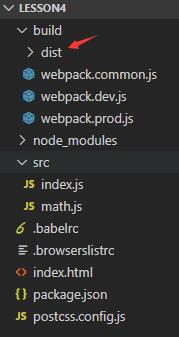
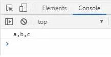
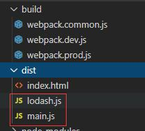
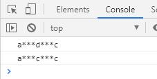

19 Webpack 和 Code Splitting（1）

> 同学们大家好，这节课我来给大家讲解`Webpack`和`Code Splitting`之间的关系。

#### 打包关于 output和CleanWebpackPlugin输出`dist`目录位置的配置修改

那`Webpack`大家现在都已经接触过了，`Code Splitting`指的是代码分割那什么是代码分割，`Webpack`和代码分割之间又有一些什么样的联系呢？

那么关于`Code Splitting`这块的内容其实涉及的`Webpack`知识点包括配置项会特别
的多，这一节主要给大家讲解清楚代码分割它和`Webpack`之间的关系到底是什么，下一章在来讲解`Webpack`中做`Code Splitting`这种代码分割涉及的大量配置的内容。

打开我们之前写的`Webpack`的代码：

（那这一章呢我们要用开发环境做代码的打包，也就是我们要运行`npm run dev`，但是如果这块我们用`webpack-dev-server`启动一个服务器的话我们就看不到打包生成的内容了，这个时候啊为了方便大家能够看到开发环境打包生成文件的形式，我们呢在创建一个命令叫做`dev-build`它呢通过`Webpack`去打包我们的代码实际上它就是用`webpack.dev.js`开发环境的配置文件帮我们做了一次打包生成一个`dist`目录）

lesson

```
build
 |-webpack.common.js
 |-webpack.dev.js
 |-webpack.prod.js
dist
 |-index.html
 |-main.js
 |-main.js.map
src
 |-index.js
 |-math.js
.babelrc
.browserslistrc
index.html
package.json
postcss.config.js
```

package.json

```
"scripts": {
    "dev-build":"webpack --config ./build/webpack.dev.js",
    "dev": "webpack-dev-server --config ./build/webpack.dev.js",
    "build": "webpack --config ./build/webpack.prod.js"
}
```

好下面呢我们运行一下`npm run dev-build`：

```
C:\Users\nickname\Desktop\lesson4>npm run dev-build
```



OK，我们来看一下啊打包正常了，然后我们看一下我们的项目大家会发现这个时候有一点问题，问题在哪呢？

我的`build`目录下正常的话是放配置文件的，但是现在多了一个`dist`目录现在打包生成的这个`dist`目录并不在`lesson`的根目录下跑到了`build`这个目录下
，这是什么原因呢，这是因为我们把`Webpack`的配置文件放到了`build`目录下它在打包的过程中呢使用的一些配置项没有进行同步的变更会导致打包生成的文件啊就放到了`build`目录下的`dist`目录下，哪怎么去解决这个问题呢？

我们打开`webpack.common.js`在这里有一个`CleanWebpackPlugin`还有一个`output`：

我们先来改`output`这块的内容，首先打包生成的文件名字不用变那它放在哪啊，我们现在这个目录是在`build`目录下，它应该放在`build`目录上一层级的这个目录下面对应的`dist`目录下，所以这块呢你直接写个`dist`指的是打包生成的文件
啊我就放在和`webpack.common.js`同级的`dist`目录下：

webpack.common.js

```
output: {
    filename: '[name].js',
     // 意思是打包生成的文件放到webpack.common.js上一层目录也就是`lesson`目录下的`dist`目录内
    path: path.resolve(__dirname, '../dist')
}
```

（CleanWebpackPlugin 配置的目录也需要修改）

```
plugins: [
    new HtmlWebpackPlugin({
      template: './index.html'
    }),
    new CleanWebpackPlugin({
      verbose: true, // 在命令窗口中打印`clean-webpack-plugin`日志
      cleanOnceBeforeBuildPatterns: [path.resolve(__dirname, '../dist')] // 清除的文件/文件夹
    })
]
```

所以这块的配置需要修改下，那在这个过程当中呢我主要要给大家强调一个什么样的事情，实际上`Webpack`的配置项和插件真的是巨多你也完全的能记住是不可能的，如果你遇到打包的问题怎么办，首先你要打开你打包的命令行工具然后呢去分析当你打包的过程开始执行时它一步一步具体的流程之中哪里出了问题，那通过控制台我们就可以找到这些问题，找到问题在怎么办我们可以把这个问题截取出来然后在百度去搜索做这种提问搜索对应问题的解决方案，那你找到解决方案之后在去找对应插件的文档去看一下文档上的配置说明跟着文档在回头去修改我们的配置文件，那改的过程中呢出现新的问题我们再去解决那一点一点我们就可以把`Webpack`的配置文件配置正确。


---

#### 文件打包过大，增加 entry 配置入口打包出多个 chunk 的方式，拆分打包文件

好接着呢我们就开始进入这节课的正题来讲一下`Code Splitting`到底是什么、代码分割到底是什么。

我给大家举一个非常简单的例子来引出这节课的内容：

首先呢我们在`index.js`中写一些代码，我们先去安装一个第三方的包，这个包呢
我相信绝大多数同学你现在都开始学习`Webpack`了那你之前项目中肯定用到过这样的一个包叫做`lodash`，它是一个功能集合它提供了很多工具方法可以让我们高性能的去使用一些比如：字符串拼接的函数啊等等。

```
F:\github-vue\workspaces\lesson1>cnpm install lodash --save
```

index.js

（其实它引入了一个库，在这里呢使用这个库做了一个字符串连接这样的一个操作最终打印出的结果应该`a,b,c`这样一个字符串）

```
import _ from 'lodash';

console.info(_.join(['a', 'b', 'c']));

```

我们运行打包命令：

```
F:\github-vue\workspaces\lesson1>npm run dev-build

> webpack-demo@1.0.0 dev-build F:\github-vue\workspaces\lesson1
> webpack --config ./build/webpack.dev.js


F:\github-vue\workspaces\lesson1>"node"  "F:\github-vue\workspaces\lesson1\node_
modules\.bin\\..\_webpack@4.42.0@webpack\bin\webpack.js" --config ./build/webpac
k.dev.js
clean-webpack-plugin: removed dist
Hash: 3f080d8d918e6a7a6274
Version: webpack 4.42.0
Time: 1475ms
Built at: 2020-03-05 12:47:15
     Asset       Size  Chunks             Chunk Names
index.html  204 bytes          [emitted]
========= 注意这里：文件以及达到了1.39M了 ============
   main.js   1.39 MiB    main  [emitted]  main
Entrypoint main = main.js
```

代码正确打包然后我们打开`dist`目录，在浏览器上去运行下`index.html`点开浏览器控制台输出了`a,b,c`。



那接下来我们来看啊现在我们打包生成的`dist`目录下有一个`main.js`，也就是我们打包的过程中呢`lodash`这个工具库以及下面我们写的`_.join(['a','b','c'])`业务代码都被打包到了一个文件中。

好那假设我的业务文件中代码量非常的多（可能有几千行代码），大家呢想象一下这个时候我引入了一个工具库同时下面又有很多的业务逻辑代码，那如果我们现在这样打包它会怎么办呢？


```
import _ from 'lodash';// 1MB

// 业务代码也有 1MB
console.info(_.join(['a', 'b', 'c']));
// 此处省略10万行业务逻辑
console.info(_.join(['a', 'b', 'c']));
```

它会把我的工具库和业务逻辑统一的打包到`main.js`这个输出文件里，那这种方法做打包有没有问题呢？

没有任何的问题，我们到代码上来看能够正确的执行没有出现任何的代码报错，但大家想实际上这会带来一个潜在的问题，潜在的问题是什么呢？

假设`lodash`这个第三方库有`1MB`，我的业务代码呢因为有几万行也有`1MB`，那打包生成的`main.js`文件它的大小就应该是多大啊（假设不做压缩）应该是`2MB`对不对。

那么如果通过这种方式生成了一个`2MB`的`js`文件，那就意味着如果用户访问我们的`index.html`这个文件它想输出我们的业务逻辑的话，它就要先去加载一个`2MB`的`js`文件它要等这个文件加载完成之后才会去执行文件里面的逻辑才会去把业务展示出来，所以这样去打包带来的第一个问题就出来了，这个问题是什么呢？
**打包文件会很大加载时间会很长**。

那我们其实在来看它还会带来另外一个问题：

我们说`lodash`这种第三方的库我们一般是不会去改它的，但是我们的业务逻辑是经常会被改变的，假设我改了一下业务逻辑：

```
import _ from 'lodash';

// 把 b 改成了 d
console.info(_.join(['a', 'd', 'c'],'***'));
// 此次省略10万行代码
console.info(_.join(['a', 'c', 'c'],'***'));
```

然后我去重新做打包，这时候又会打包出一个新的`main.js`文件它是多大呢？又是`2MB`，那如果用户重新访问我们的页面的话又要加载`2MB`的内容。

好大家来整理下两个问题啊：

- 第一点是我们打包整个的`main.js`是2MB，所以用户先访问页面的时候要加载这`2MB`的代码所以呢时间会比较长。
- 第二个问题是假设我们修改了我们的业务代码，那用户呢需要重新去加载`main.js`才能获取到最新的代码执行显示最新的内容，那么只要意味着代码一变更用户就要重新去加载`2MB`的内容。

那想一想我们有没有办法去解决这个问题呢？

其实是有的，我们这样来做在`src`目录下我在创建一个文件叫做`lodash.js`，然后我们呢把`index.js`里面关于`lodash`的引入放到我们新建的`lodash.js`文件里面：

lodash.js

```
import _ from 'lodash'; 
window._ = _

```

这个文件做了一件什么样的事情，它呢就是加载了`lodash`这个第三方库，然后把`lodash`挂载到了一个全局的`window`对象上面，这样的话我们在我们的控制台里面或者说在其它的地方就可以直接去使用`window._`这个变量了，这就是我们新建的`lodash.js`这个文件的作用。

接着我们再来看`index.js`，那`index.js`这里面直接只写我们的业务逻辑就可以了

index.js

```
// import _ from 'lodash'; // 1MB

// main.js 2mb
// 打包文件会很大，加载时间会长
// main.js 2mb
// 重新访问我们的页面，又要加载2mb的内容


// 业务逻辑 1MB
console.info(_.join(['a', 'd', 'c'],'***'));
// 此次省略10万行代码
console.info(_.join(['a', 'c', 'c'],'***'));

```

OK，我们在做一个页面的配置：

打开`webpack.common.js`找到`entry`这个位置，以前呢在`entry`这里我只有一个入口文件是`./src/index.js`，现在我在加一个叫做`lodash`:

那当我们在配置一个入口重新打包大家会看到我们现在打包内容的区别

```
entry: {
    // main: ['./src/index.js']
    lodash: './src/lodash.js',
    main: './src/index.js'
},
output: {
    filename: '[name].js',
    path: path.resolve(__dirname, '../dist')
}
```

重新打包

```
C:\Users\nickname\Desktop\lesson4>npm run dev-build

> webpack-demo@1.0.0 dev-build C:\Users\nickname\Desktop\lesson4
> webpack --config ./build/webpack.dev.js


C:\Users\nickname\Desktop\lesson4>"node"  "C:\Users\nickname\Desktop\lesson4\node_modules\.bin\\..\_webpack@4.42.0@webpack\bin\webpack.js" --config ./build/webpack.dev.js
Hash: 497511e9130e3cc2df7e
Version: webpack 4.42.0
Time: 1867ms
Built at: 2020-03-05 21:15:04
     Asset       Size  Chunks             Chunk Names
index.html  260 bytes          [emitted]
========= 注意这里 ===========
   main.js   29.9 KiB    main  [emitted]  main
 lodash.js   1.39 MiB  lodash  [emitted]  lodash

Entrypoint lodash = lodash.js
Entrypoint main = main.js

```




好回来看`dist`目录，大家可以看到打包会生成两个文件：

- 第一个文件是`lodash.js`
- 第二个是`main.js`

然后`index.html`上这个时候它会同时引入`lodash.js`和`main.js`，我们把之前打包的`main.js`一个代码现在抽成了两个代码文件一个是`lodash.js`一个是`main.js`


```
<!DOCTYPE html>
<html lang="en">
<head>
	<meta charset="UTF-8">
	<title>html 模板</title>
</head>
<body>
	<div id='root'></div>
<script type="text/javascript" src="lodash.js"></script>
<script type="text/javascript" src="main.js"></script>
</body>
</html>
```

好我们再来看一下现在`index.html`能不能打开或者说呢它打开能不能正确的输出
这个源代码里面`console.log()`这块的内容啊。

在浏览器上打开`dist`目录中的`index.html`



大家可以看到`a***d***c`和`a***c***c`对应我们`index.js`源码里面的内容是都能输出出来的，没有任何的问题这样的我们就换了一种打包方式，之前打包方式我们来看`main.js`一共有多大一共有`2MB`就意味着用户需要加载完`2MB`的东西才能展示页面，但是现在我们把一个`main.js`拆分成了两个js文件分别是`lodash.js`和`main.js`，那这种方式我们去想：

main.js（2MB）被拆分成 lodash.js（1MB）和main.js（1MB）它俩都是1MB，大家想是不是这样的因为在源代码里面包括打包生成的文件里面`lodash`这个打包输出的文件里只有`lodash`这个第三方库，那`lodash`这个第三方库只有1MB所以打包生成的`lodash.js`只有1MB，那打包输出的`main.js`也就是现在的`index.js`它里面只有我们的业务代码所以呢它也是1MB，好这个时候假设用户访问页面的时候他就不需要加载一个2MB的内容了，他需要加载两个1MB的内容（大家知道浏览器上可以并行的加载文件在大量的实践之种呢我们可能会发现同时并行的去加载两个1MB的代码可能比加载一个2MB的代码要稍微快一点，当然这不是绝对的）。

好我们在来分析啊之前假设我们去改了业务代码，然后呢用户需要把一个2MB的文件重新加载一下才能访问到新的业务代码产生的内容，但是假设现在我们这种打包方式那我们的业务逻辑进行了变更，用户需不需要重新的去加载这个`lodash.js`这个文件啊，实际上不需要`lodash.js`没有做任何的变更它在用户的浏览器里是由缓存的，所以用户只要加载什么就行了只要重新加载`main.js`就可以了，所以这样的话呢重新访问页面的时候第二种方式就可以有效的提升我们这个页面展示的速度。


