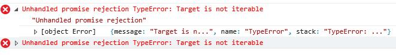

22-1 ie环境下的动态 import 导入需要的兼容性配置

这里先主要讲一下`ie`环境下的动态`import`导入需要的兼容性配置。

我在`src`目录下把`index.js`中的写了一段动态导入`import('lodash')`的代码，但是打包后在`ie`的环境下却报错了（Chrome下运行正常）：

`Unhandled promise rejection TypeError: Target is not iterable`



这个问题报错的时候我就想到肯定是`babel`没有配置好，在`ie`下的兼容性问题（万恶的ie）。

但是开始我并不知道是`babel`中哪一个依赖没有加载，在找了很多资料后终于在官方文档上看到了一句话，是这么说的：

[->官方文档](https://babeljs.io/docs/en/babel-plugin-syntax-dynamic-import#working-with-webpack-and-babel-preset-env)

```
Currently, @babel/preset-env is unaware that using import() with Webpack relies on Promise internally. Environments which do not have builtin support for Promise, like Internet Explorer, will require both the promise and iterator polyfills be added manually.
```

意思是如果在`ie`（不包含微软最新的`edge`浏览器）中运行还需要额外的`promise`和`iterator`的`polyfill`垫片依赖。

看下我的代码：

index.js

```
// 第一种解决方案：ie 下运行需要加入下面这两句配置
// import "core-js/modules/es.promise";
// import "core-js/modules/es.array.iterator";

function getComponent() {
    // return "111";
    // return import("lodash")
  return import("lodash").then(() => {
    console.log("success");
    var element = document.createElement("div");
    element.innerHTML = _.join(["hello", "world"], "-");
    return element;
  });
    /* return new Promise((resolve)=>{
      var element = document.createElement("div");
      element.innerHTML = _.join(["hello", "world"], "-");
      resolve(element)
    }); */
}
// getComponent()
getComponent().then(element => {
    document.body.appendChild(element)
//   console.log(element);
});
```

第二种解决方案：

webpack.common.js

数组写法：

```
entry: [
  "core-js/modules/es.promise",
  "core-js/modules/es.array.iterator",
  "./src/index.js"
]
```

对象写法：

```
entry: {
  iterator: "core-js/modules/es.array.iterator",
  Promise: "core-js/modules/es.promise",
  main: "./src/index.js"
}
```

这样我在最终的打包后在`Chrome`和`ie`下都能正确运行`index.html`了。

具体的一些配置可以看我的项目`lesson`的配置。
