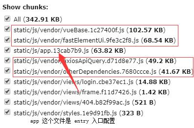

这里我把 vue、vuex和vue-router分割到了 vueBase 这个缓存组

fast-elemnt-ui分割到了 fastElementUi 这个缓存组

axios-api-query分割到了 axiosApiQuery 这个缓存组

其它的一些第三方依赖库统一分配到了 otherDependencies 这个缓存组

注意：

cacheGroups 默认会有两个缓存组的配置

```
cacheGroups: {
    vendors: {
        test: /[\\/]node_modules[\\/]/, // 正则规则，如果符合就提取 chunk
        priority: -10 // 缓存组优先级，当一个模块可能属于多个 chunkGroup，这里是优先级
    },
    default: {
        minChunks: 2,
        priority: -20, // 优先级
        reuseExistingChunk: true // 如果该chunk包含的modules都已经另一个被分割的chunk中存在，那么直接引用已存在的chunk，不会再重新产生一个
    }
}
```

这两个组如果我们把它们从`cacheGroups`中删除我测试后发现默认还是会自动添加进去，所以如果不想要就设置成 false。

maxInitialRequests: 6 `cacheGroups`里面的缓存组设置已经超过了默认的3，所以我们需要扩大缓存组的数量。


#### 配置：

```
cacheGroups: {
    vendors: {
        test: /[\\/]node_modules[\\/]/, // 正则规则，如果符合就提取 chunk
        priority: -10 // 缓存组优先级，当一个模块可能属于多个 chunkGroup，这里是优先级
    },
    default: {
        minChunks: 2,
        priority: -20, // 优先级
        reuseExistingChunk: true // 如果该chunk包含的modules都已经另一个被分割的chunk中存在，那么直接引用已存在的chunk，不会再重新产生一个
    }
}
```

这两个组如果我们把它们从`cacheGroups`中删除我测试后发现默认还是会自动添加进去，所以如果不想要就设置成 false。

maxInitialRequests: 6 `cacheGroups`里面的缓存组设置已经超过了默认的3，所以我们需要扩大缓存组的数量。


#### 配置：

```
splitChunks: {
      chunks: 'all', // initial（有共用的情况即发生拆分）async（异步 动态引入的模块不受影响，它是无论如何都会被拆分出去的）all（同步和异步），推荐 all
      minSize: 30000, // 模块最小尺寸，30K，越大那么单个文件越大，chunk 数就会变少（针对于提取公共 chunk 的时候，不管再大也不会把动态加载的模块合并到初始化模块中）当这个值很大的时候就不会做公共部分的抽取了
      maxSize: 0, // 模块最大尺寸，0为不限制
      minChunks: 1, // 默认1，被提取的一个模块至少需要在几个 chunk 中被引用，这个值越大，抽取出来的文件就越小
      maxAsyncRequests: 5, // 在做一次按需加载的时候最多有多少个异步请求，为 1 的时候就不会抽取公共 chunk 了（一般不用改）
      maxInitialRequests: 7, // 针对一个 entry 做初始化模块分隔的时候的最大文件数，优先级高于 cacheGroup，所以为 1 的时候就不会抽取 initial common 了（一般不用改）
      automaticNameDelimiter: '~', // 打包文件名分隔符
      name: true, // 拆分出来文件的名字，默认为 true，表示自动生成文件名，如果设置为固定的字符串那么所有的 chunk 都会被合并成一个
      // 同步导入进入的分割规则，异步动态import使用 魔法注释
      // 这里的缓存组已经超过 3 ，请修改 maxInitialRequests 否则最多只能分割出 3 个文件
      cacheGroups: {
        /* vendors: {
          test: /[\\/]node_modules[\\/]/, // 正则规则，如果符合就提取 chunk
          priority: -10 // 缓存组优先级，当一个模块可能属于多个 chunkGroup，这里是优先级
        }, */
        vendors: false, // 这里我把默认的 vendors 组设置成 false
        vueBase: {
          name: 'vueBase',
          // test: /_vue@2.6.11@vue|_vuex@3.3.0@vuex|_vue-router@3.1.6@vue-router/ig, // /vue/ig 这样写会匹配到 vuex vue-router 这些其它包含 vue 字符的库
          test: /_vue|_vue(x|-router).{0,}/ig,
          enforce: true,
          priority: 10
          // filename: utils.assetsPath('js/vendor/vueBase.[chunkhash].js')
        },
        fastElemntUi: {
          name: 'fastElementUi',
          test: /fast-element-ui/ig, // _fast-element-ui@0.1.32@fast-element-ui
          priority: 10,
          enforce: true
        },
        axiosApiQuery: {
          name: 'axiosApiQuery',
          test: /axios-api-query/ig,
          priority: 10,
          enforce: true
          // priority: 10
        },
        otherDependencies: {
          name: 'otherDependencies',
          test: /vdjs|querystring|nprogress|moment|lodash-es|element-ui|vuex-persistedstate/ig,
          enforce: true
          // priority: 10
        },
        styles: {
          name: 'styles',
          test: /\.css$/,
          chunks: 'all',
          enforce: true // 忽略默认的参数（比如：minSize）只要是 .css 文件就做代码的拆分
        },
        default: {
          // 这里需要你理解 chunk 是什么，这里的 2 并不是你 import 的次数超过 2，import 的是 module
          // chunk 包含着 module，可能是一对多也可能是一对一，一般一个 chunk对应一个bundle
          // 所以如果我们是单页面（一个chunk一个bundke），那么其实 default 如果设置的是 2 这个缓存组也就不会进行代码的分割
          minChunks: 2,
          /* minChunks: 1,
          minSize: 0, 这两个配置可以在单页面（一个chunk一个bundke）中将 import 引入的 src 目录下的 module 不论大小都分割到 default 这个组里，一般不建议这么做 */
          priority: -20,
          reuseExistingChunk: true // 是否使用已有的 chunk，如果为 true 则表示如果当前的 chunk 包含的模块已经被抽取出去了，那么将不会重新生成新的。
        }
      }
    }
```

打包后的结果：




