24 打包分析，Preloading, Prefetching

> 前言：这几课来给大家讲三个知识点分别是：打包分析、Preloading和Prefetching。

[->预取/预加载模块Preloading, Prefetching](https://webpack.docschina.org/guides/code-splitting/#%E9%A2%84%E5%8F%96-%E9%A2%84%E5%8A%A0%E8%BD%BD%E6%A8%A1%E5%9D%97-prefetch-preload-module-) 

#### webpack/analyse 官方提供的打包过程分析工具

首先我们来看打包分析：

打包分析：指的是当我们使用`Webpack`进行代码的打包之后呢，我们可以借助打包分析的一些工具来对我们打包生成的文件进行一定的分析，然后来看一下它打包是否合理，我们进入到一个网站这个网站呢是`Webpack`官方提供的一个`github`的
仓库地址：

[->webpack/analyse](https://github.com/webpack/analyse)

好其实呢这就是`Webpack`分析工具的一个git仓库我们到下面可以看到啊，这里面它呢会讲一些怎么去使用这个仓库实际上我来带大家操作一下非常的简单。

那如果想要对我们打包生成的代码进行一些分析，我们首先要生成一个打包过程的描述文件，通过`Webpack/analyse`这个网站上这条命令：

```
webpack --profile --json > stats.json
```

我们怎么使用这条命令呢，我们打包`lesson`项目里的`package.json`在`dev-build`的时候我们在`--congfig`前面`--profile --json > stats.json`它的意思是呢：

在打包的过程中啊我呢把整个打包过程的一些描述放置到一个名字叫做`stats.json`的文件里面它这个文件的格式是`json`的格式，

```
  "scripts": {
    "dev-build": "webpack --profile --json > stats.json --config ./build/webpack.dev.js",
    "dev": "webpack-dev-server --config ./build/webpack.dev.js",
    "build": "webpack --config ./build/webpack.prod.js"
  },
```

当我们这么去配置完了之后回到我们的控制台里面，我们就行一次打包`npm run dev-build`：

```
F:\github-vue\workspaces\lesson2>npm run dev-build

> webpack-demo@1.0.0 dev-build F:\github-vue\workspaces\lesson2
> webpack --profile --json > stats.json --config ./build/webpack.dev.js

clean-webpack-plugin: removed dist
```

lesson

```
build
 |-webpack.common.js
 |-webpack.dev.js
 |-webpack.prod.js
dist
 |-index.html
 |-main.js
 |-vendors~lodash.js
src
 |-index.js
.babelrc
.browserslistrc
index.html
package.json
postcss.config.js
stats.json
```

然后我们打开`lesson`这个目录，大家可以看到啊在根目录下它帮助我们生成了一个名字叫做`stats.json`的文件，你可以在编辑器里面去看一看：

stats.json

```
{
  "errors": [],
  "warnings": [],
  "version": "4.42.0",
  "hash": "41c1d96e8976290efdd2",
  "time": 3232,
  "builtAt": 1584334288687,
  "publicPath": "",
  "outputPath": "F:\\github-vue\\workspaces\\lesson2\\dist",
  ......
}
```

实际上呢它里面是一些对打包过程的一个描述，比如说啊这里我静态资源有`index.html`有`main.js`然后呢它所处的这个`Chunks`也就是它对应的这个文件名。

stats.json

```
"assets": [
    {
      "name": "index.html",
      "size": 204,
      "chunks": [],
      "chunkNames": [],
      "info": {},
      "emitted": true
    },
    {
      "name": "main.js",
      "size": 36360,
      "chunks": [
        "main"
      ],
      "chunkNames": [
        "main"
      ],
      "info": {},
      "emitted": true
    },
    {
      "name": "vendors~lodash.js",
      "size": 1422175,
      "chunks": [
        "vendors~lodash"
      ],
      "chunkNames": [
        "vendors~lodash"
      ],
      "info": {},
      "emitted": true
    }
  ]
```

所以这个文件呢就是对整个打包过程的描述性文件。

那如果我们去看这个描述性的文件然后来分析打包的这个流程就比较麻烦了，好生成完这个文件之后我们可以借助一些工具来去分析这个文件里的内容。

我们回到我们的`webpack/analyse`网站上在文档里有一个站址叫做：

```
http://webpack.github.com/analyse
```

（注意：需要翻墙科学上网）

（这里由于我无法翻墙，所以截图是视频上的图）

（如果不是特别必须可以在[这里](https://www.webpackjs.com/guides/code-splitting/#bundle-%E5%88%86%E6%9E%90-bundle-analysis-)使用其它工具进行打包过程分析也是图形化展示）

这个网站会打不开原因是这个网站有的时候需要我们做一个科学上网也就是翻墙。

好翻墙之后呢我们可以打开这个网站，点击`JSON file`把我们刚才生成的这个`stats.json`传上去：

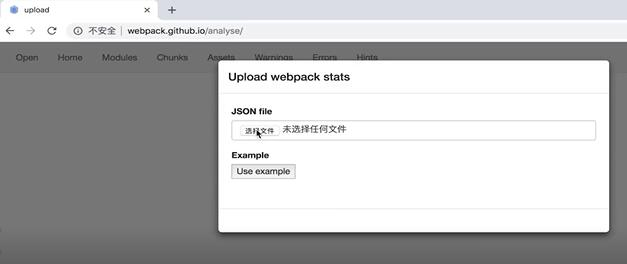

上传上去之后大家可以看到它呢会帮助我们进行我们打包的内容的分析：

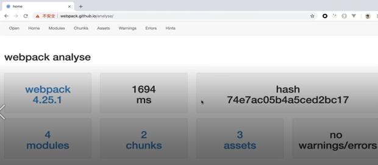

它会告诉我们整个打包使用的是`Webpack 4.25.1`的这个版本进行的打包，耗时呢
`16.94`秒，这次打包过程对于的`hash`值是这个值，里面有四个`modules`模块，两个`chunks`也就是两个文件，三个静态文件也就是打包生成的静态文件有三个，`no warnings/errors`打包过程没有警告也没有异常。

所以有的时候我们做打包啊，想去看一些打包的一些具体的内容，具体的一些打包模块的一些关系的时候，我们就可以借助这样的工具来帮助我们实现这样打包过程的分析。

---


除了官方提供的这个工具之外还有很多其它的这种工具可以供我们使用我们可以打开[Webpack](https://www.webpackjs.com/concepts/)的官网，点击进入[guides（指南）](https://www.webpackjs.com/guides/)在指南的左侧有一个[code-splitting（代码分离）](https://www.webpackjs.com/guides/code-splitting/)，`code-splitting`里面就有一个叫做[bundle-analysis（bundle 分析）](https://www.webpackjs.com/guides/code-splitting/#bundle-%E5%88%86%E6%9E%90-bundle-analysis-)这样的一个菜单，点击`bundle-analysis`这里面它会告诉我们官方有一个工具就是刚才我们使用的这个工具，还有比如说：

-`webpack-chart`这样的工具，我们点击看一下这是通过一个图标的形式帮助我们进行`Webpack`打包代码的分析：

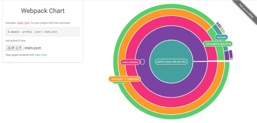

-`webpack-visualizer`包括`webpack-bundle-analyzer`这些东西都是通过可视化的一些工具帮助我们分析`Webpack`打包过程的一些工具。

那看一下我用的比较多的是`webpack-bundle-analyzer`这个东西，那它呢是一个
插件需要我们安装，所以这里呢我就不再演示了，大家呢如果感兴趣你可以打开它的[->官方网站](https://github.com/webpack-contrib/webpack-bundle-analyzer)然后呢照着它下面的说明进行一些安装然后呢它会在打包的过程中会生成这样的图标：
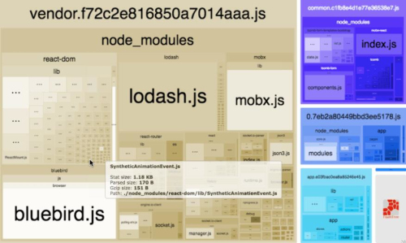

告诉你打包文件里面的一些依赖关系，这个图它表示的内容是比较全的所以我一般比较喜欢使用它。

这样的话我就给大家简单的介绍了一下`analysis`打包分析工具的一个使用，它可以帮助我们去分析打包生成代码里面一些依赖关系，当我们做复杂项目打包的时候
有的时候代码分割出的这个代码形式不是太和我们预期相符，那我们呢就可以通过
这种工具来做一些分析看一看是不是有一些代码重复打包了呀，是不是有些地方可以优化呀，那一部分代码打包耗时比较长呀都可以通过这个分析工具来帮助我们做好这样的分析。

---

#### Coverage面板查看代码使用率或者说是代码覆盖率

好，接着呢我们再来讲两个知识点：

- Preloading
- Prefetching

那这两个知识点把它搞清楚对大家的帮助还是非常大的，所以大家仔细来听下面的课程。

首先打开之前我们写的代码`lesson`找到`build`目录下的`webpack.common.js`这个文件然后我们往下找，在这里：

```
optimization: {
  splitChunks: {
   // 这里我不设置成`all`，主要是因为我设置了`babel`在不同浏览器下的打包配置（详见.babelrc）
   // 不然打包的时候`Webpack`会把`babel`的`es6`转义也单独打成一个chunk文件
    chunks: "async"
  }
}
```
`splitChunks.chunks`我们默认配置成`all`意思就是不管同步代码还是异步代码我们呢都对它进行分片打包。

但是如果大家呢阅读`Webpack`的官方文档，假设我在这没有配置这个`chunks`它默认的值是说明呢？

它默认的值不是`all`而是`async`也就是`Webpack`默认只对异步代码进行代码分割，那`Webpack`为什么要这么做呢：

我们之前也给大家讲了你如说像`jquery`啊像`lodash`这种库啊那这样的代码你呢对它进行代码分割不是可以有效的提升我们代码的性能嘛，大家想一想是不是这么一回事呢？


实际上当我们把`jquery`或者`lodash`这种库单独打包生成一个文件的时候第一次访问的时候我们加载就可以了，第二次访问的时候我们就可以借助缓存提高访问的速度，但这样的话它只不过是提高我们第二次加载页面的一个访问速度，那真正我们说对页面性能做优化其实`Webpack`希望达到的一个效果是：

当你第一次访问页面的时候它的加载速度就是最快的，那想实现这样的一个效果的话，你靠这种`jquery`啊`lodash`啊打包成一个单独的文件它是满足不了你的需求的，那`Webpack`真正希望我们编写代码的方式是什么样子的呢？

这节课我来给大家讲解，首先呢我把这块代码去掉，这里我们先把它改成`async`或者写成`all`无所谓的，然后我们去写我们的源代码：

index.js

```

document.addEventListener("click", () => {
  var element = document.createElement("div");
  element.innerHTML = "hello world";
  document.body.appendChild(element);
});
```

这是一个以前标准的`js`写法，我们点击`click`事件的时候创建一个元素内容是`hello-world`然后把元素挂载到页面上，大家觉得这段`js`代码有没有问题啊？

肯定是没有任何问题的，我们可以运行一下试一试`npm run build`：

```
C:\Users\nickname\Desktop\lesson>npm run build

> lesson@1.0.0 build C:\Users\nickname\Desktop\lesson
> webpack --config ./build/webpack.prod.js


C:\Users\nickname\Desktop\lesson>"node"  "C:\Users\nickname\Desktop\lesson\node_modules\.bin\\..\_webpack@4.42.0@webpack\bin\webpack.js" --config ./build/webpack.prod.js
clean-webpack-plugin: removed dist
Hash: ec9a026bcc1acebc878d
Version: webpack 4.42.0
Time: 2323ms
Built at: 2020-03-19 21:35:13
      Asset       Size  Chunks                   Chunk Names
 index.html  204 bytes          [emitted]
    main.js     22 KiB       0  [emitted]        main
main.js.map   97 bytes       0  [emitted] [dev]  main
Entrypoint main = main.js main.js.map
```

dist

```
dist
 |-index.html
 |-main.js
 |-main.js.map
```

然后我们在浏览器上去打开这个`dist`目录下的`index.html`，`hello world`已经输出出来了，就说明我们代码写的没有问题。

但是这段代码完全优化的空间了吗，或者说这是不是一个最标准的`Webpack`推荐的一种代码编写的方式呢？

实际上不是的我给大家来讲述一下：

首先在这里我们点开控制台，然后在控制台里面我们输入`Ctrl+Shift+p`这个命令，好在这里面我们去输入`cove`这个关键词：

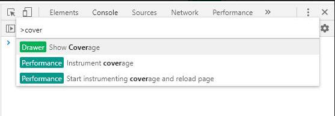

我们可以看到有一个功能叫做`Show Coverage`点击一下，点击完了之后：

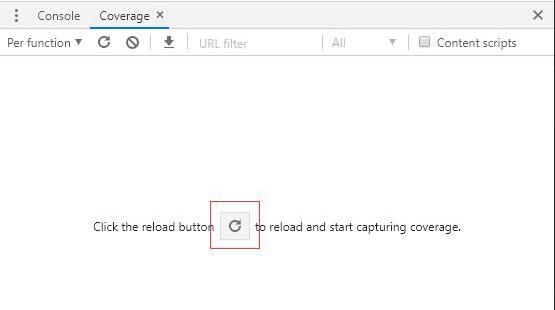

在`Coverage`中间会出现一个刷新的按钮（比较旧的Chrome的`Coverage`可能是在`Coverage`面板的左上角有一个录制的按钮）我们点一下按钮变红之后我们刷新页面：
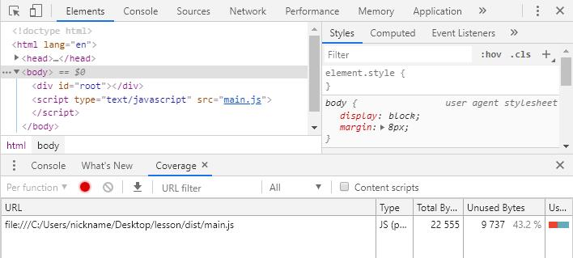

这个时候大家看啊，它会告诉我们这个页面加载了一个`js`文件叫`main.js`，`main.js`它的利用率只有百分之`43.2%`，那为什么`main.js`它的利用率只有`43.2%`呢，我们来看一下，我们打开`main.js`（在`Coverage`面板上的`main.js`双击）之后呢左侧它会告诉我们哪些代码是`main.js`里面在这个页面上被用到的部分哪些是`main.js`在这个页面上没有用到的部分，我们往下去翻大家可以看到：

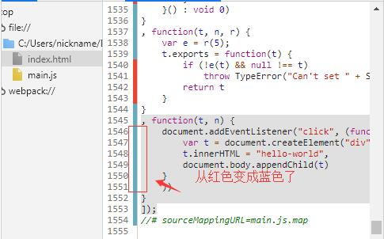

```
, function(t, n) {
    document.addEventListener("click", (function() {
        var t = document.createElement("div");
        t.innerHTML = "hello-world",
        document.body.appendChild(t)
    }
    ))
}
]);
```

我们呢往`dom`上挂载了一个`click`事件，但是`click`事件里面的代码现在有没有任何的用处啊，完全没有用到因为你这个页面加载的时候，你只有点击了这个页面的时候，大家看啊点击完了之后这段代码它变绿了：


也就是说你点击之后这里面的这段代码才有执行的意义，而一开始刚加载的时候你这里面的代码压根就不会执行，不会执行的代码你让页面一加载的时候就下载下来实际上就会浪费页面执行的性能。

那`Webpack`希望像这种交互的代码：

```
  var element = document.createElement("div");
  element.innerHTML = "hello-world";
  document.body.appendChild(element);
```

应该怎么写呢，应该把它放到一个异步加载的模块里面去写，所以呢它会建议我们这么去写：

我们写一个`click.js`这样的文件

click.js

```
function handlerClick() {
  var element = document.createElement("div");
  element.innerHTML = "hello-world";
  document.body.appendChild(element);
}
export default handlerClick;

```

index.js

```
document.addEventListener("click", () => {
/*   var element = document.createElement("div");
  element.innerHTML = "hello-world";
  document.body.appendChild(element); */
  import('./click.js').then(({default: func})=>{
    // func就是我们导出的 handlerClick 这个方法
    func();
  })
});
```

然后我们重新打包`npm run build`：

```
C:\Users\nickname\Desktop\lesson>npm run build

> lesson@1.0.0 build C:\Users\nickname\Desktop\lesson
> webpack --config ./build/webpack.prod.js


C:\Users\nickname\Desktop\lesson>"node"  "C:\Users\nickname\Desktop\lesson\node_modules\.bin\\..\_webpack@4.42.0@webpack\bin\webpack.js" --config ./build/webpack.prod.js
clean-webpack-plugin: removed dist
Hash: 87c777bc2d50e7bd6240
Version: webpack 4.42.0
Time: 2564ms
Built at: 2020-03-19 22:00:53
      Asset       Size  Chunks                   Chunk Names
       1.js  243 bytes       1  [emitted]
   1.js.map   91 bytes       1  [emitted] [dev]
 index.html  204 bytes          [emitted]
    main.js   23.4 KiB       0  [emitted]        main
main.js.map   97 bytes       0  [emitted] [dev]  main
Entrypoint main = main.js main.js.map
```

dist

```
dist
 |-1.js
 |-1.js.map
 |-main.js
 |-main.js.map
```

没有任何问题打包成功了，这个时候我们在去浏览器上运行我们的`index.html`，点开浏览器的控制台我们在去找到`Coverage`面板（输入Ctrl+Shift+p这个命令，好在这里面我们去输入cove这个关键词），录制下屏幕，大家可以看到这个时候之前我们的代码利用率只有`43.2%`，现在我们的代码利用率变成了`44.2%`：

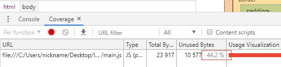

那为什么代码的利用率变高了呢？

是因为大家还是在`Coverage`面板内双击`main.js`这个`URL`在打开的`main.js`源代码页面大家往下翻：
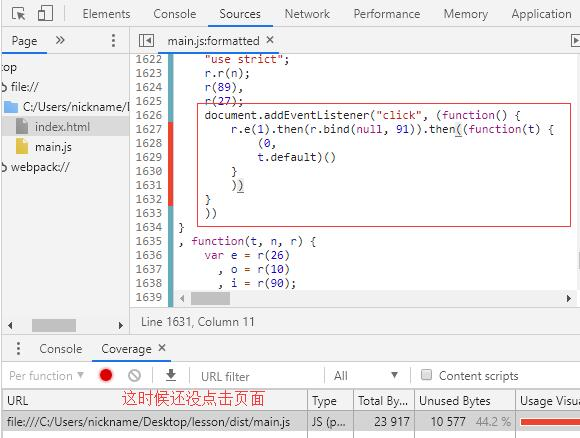

```
document.addEventListener("click", (function() {
    r.e(1).then(r.bind(null, 91)).then((function(t) {
        (0,
        t.default)()
    }
    ))
}
```

是因为`click`回调函数里面的代码变少了，好也就是你点击时候业务逻辑现在我在加载这个页面的时候并没有去加载这个业务逻辑。

什么时候去加载的呢？

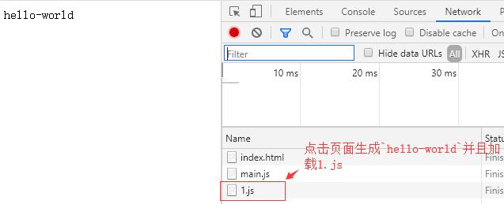

1.js

```
(window.webpackJsonp=window.webpackJsonp||[]).push([[1],{91:function(n,e,o){"use strict";o.r(e),e.default=function(){var n=document.createElement("div");n.innerHTML="hello-world",document.body.appendChild(n)}}}]);
//# sourceMappingURL=1.js.map
```

大家来看啊我点击`Network`当我点页面的时候这个时候`1.js`被加载了，`1.js`里面的内容是什么我们可以看一下，大家可以看到`1.js`的内容就是创建`div`往页面上挂载`hello-world`这样的逻辑.

那这么去写代码才是让页面加载速度最快的一种正确编写代码的方式，所以啊我们再写高性能前端代码的时候，其实现在应该重点考虑的不是缓存这样的东西。

而是什么？而是代码的使用率那么今天我也给大家讲解了如果去看我们页面的代码
使用率。

我们呢可以去看看别的一个网站的代码使用率，比如说找到[->慕课网](https://www.imooc.com/)然后呢我们点击控制台输入`Ctrl+Shift+P`然后输入`cove`这个关键词我们选择`Show Coverage`打开`Coverage`面板，开始录制：

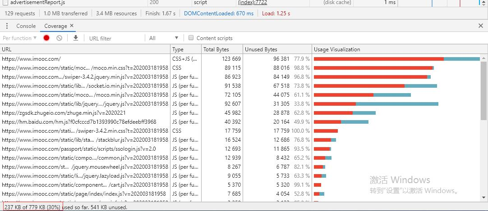

大家可以看到慕课网的官网上它有很多这样的js文件，每个js文件的利用率呢在右侧的`Unused Bytes`中都可以看到，整体的js文件的利用率是`70%`其实做的已经不错了，但是你看到一共这个页面加载了`779KB`的js文件，但实际上在页面渲染的时候真正有用的js文件只有`238KB`，所以还有`541KB`的内容是可以优化掉的，如果能把这些代码变成异步加载的代码那么我们看到的网页的首屏的时间就会变的更短，网页访问的速度就会更快。

所以呢`Webpack`它在它的打包过程中呢是希望你尽可能的多写这种异步加载的代码的，同时呢它会认为你同步的代码打包在一起生成一个`vendors.js`意义是不大的，只有呢多写一些异步这样的代码才能让你的网站的性能真正的得到提升，这也就是为什么`Webpack`默认它的配置项里面：

```
optimization: {
    splitChunks: {
      chunks: "async"
    }
}
```

它的配置项默认是`async`而不是`all`，也就是它认为只有异步这样的组件或者模块才能真正的提升你网页的打包性能，而同步的这种代码呢它只能增加一个缓存实际上对性能的提升是非常有限的。

---

#### Preloading, Prefetching 预取/预加载模块

好说到这里呢，我就给大家举一个真正项目中我们可以应用这种异步代码的典型场景：

比如说啊我们打开慕课网，当我们点击登录的时候会弹出一个登录框那这个框的代码实际上在首页加载的时候啊就不应该把它的代码加载下来。

什么时候加载呢，点击这个登录按钮的时候在去加载这个框的逻辑代码是比较合适的，这个时候聪明的同学就会提出一个问题？

那如果你点击的时候才去加载这个框的代码，那实际上用户的点击交互反应速度是不是会很慢啊，确实会有这个问题，那什么可以帮助我们解决这个问题呢就是我们接下来要说到的这个`Preloading`和`Prefetching`。

好我们可以这样来想，假设啊我一开始访问首页的时候不需要加载登录这块的逻辑，它只加载其它部分的逻辑，等这些逻辑都加载完之后是不是页面就展示出来。

好当页面被展示出来的时候页面上的带宽已经被释放出来了，这个时候呢你可以认为网络呢已经空闲了，我们首页相关的核心逻辑都已经展示出来了，网络现在又是空闲的那我们可不可以在这个空闲的时候偷偷的把登录模块的代码下载下来，而不是等你点击登录的时候再去下载它的代码，如果能在空闲的时间偷偷的把登录模块的代码下载下来那么是不是你点击登录的时候就可以迅速的展示出这个登录框了啊。

如果它能够利用到这个空闲的时间就既满足了我们首页核心代码加载非常快的一个要求又满足了我们点击登录按钮展示登录框非常快的一个需求：

所以这是一个最好的解决方案了，那这个解决方案就是依赖这个叫做`Preloading `和`Prefetching` Webpack里面的这种打包的特性来帮助我们实现的。

我们可以怎么做：

我们可以利用一个`魔法注释`的语法：

```
import(/* webpackPrefetch: true */ 'LoginModal');
```

我们复制`/* webpackPrefetch: true */`放到哪里去啊，放到我们这个:

```
document.addEventListener("click", () => {
/*   var element = document.createElement("div");
  element.innerHTML = "hello-world";
  document.body.appendChild(element); */
  import(/* webpackPrefetch: true */ './click.js').then(({default: _})=>{
    _();
  })
});
```

好它的意思就是当我点击`click`事件的时候它会帮我去加载`click.js`这个文件当然呢它不是非得等到你点击这个事件发生的时候才去加载`click.js`这个文件
，而是一旦发现你现在主要的`js`文件都加载完成了之后这个网络带宽有空闲的时候它就会偷偷的帮你把`click.js`预先加载好。

我们看一下写了`/* webpackPrefetch: true */`之后是不是这样一个效果：

那我们之前没写`/* webpackPrefetch: true */`这个的时候页面刷新完成是不会自动去加载`1.js`这个文件的，只有当我们点击了页面之后才会去加载。

我们重新打包`npm run build`：

```
C:\Users\nickname\Desktop\lesson>npm run build

> lesson@1.0.0 build C:\Users\nickname\Desktop\lesson
> webpack --config ./build/webpack.prod.js


C:\Users\nickname\Desktop\lesson>"node"  "C:\Users\nickname\Desktop\lesson\node_modules\.bin\\..\_webpack@4.42.0@webpack\bin\webpack.js" --config ./build/webpack.prod.js
clean-webpack-plugin: removed dist
Hash: 8598025dfbbd22b37c4e
Version: webpack 4.42.0
Time: 4733ms
Built at: 2020-03-21 19:26:21
      Asset       Size  Chunks                   Chunk Names
       1.js  243 bytes       1  [emitted]
   1.js.map   91 bytes       1  [emitted] [dev]
 index.html  204 bytes          [emitted]
    main.js   23.6 KiB       0  [emitted]        main
main.js.map   97 bytes       0  [emitted] [dev]  main
Entrypoint main = main.js main.js.map (prefetch: 1.js 1.js.map)
====== 注意：这里有个 prefetch ==========
```

好我们在刷新页面，大家可以看到这个时候`index.html`加载了，`main.js`核心的逻辑完成之后网络空闲的时候它会偷偷的把`1.js`也预先加载好，这样的话你在点击页面的时候，大家可以看到啊你呢还是会去加载一下`1.js`，只不过这个`1.js`现在已经怎么样呀：

因为你之前已经加载过一次`1.js`了所以你在你的本地已经有缓存了，你会发现你在加载`1.js`的时候就不是`7ms`而是变成了短短的`2ms`，因为它可以充分的利用
你浏览器上的缓存。

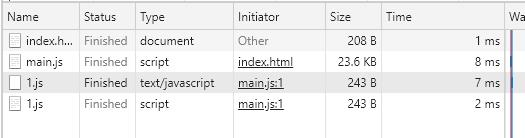

所以`Preloading`或者说`Prefetching`它就是这样的一个功能，但是呢`Preloading`或者`Prefetching`它有一个区别，我们可以简单的来看一下文档上是怎么说的：

现在我们用的这个`魔法注释`是`webpackPrefetch`当然呢你也可以给它写成`webpackPreload`。

好`prefetch`和`preload`呢它的区别在哪：

与 prefetch 指令相比，preload 指令有许多不同之处：

- prefetch(预取)：将来某些导航下可能需要的资源。
- preload(预加载)：当前导航下可能需要资源。


`prefetch` 呢会等待你的核心代码加载完成之后页面带宽空闲的时候再去加载你`prefetch`对应的js文件，也就是说你这个`click.js`会等到主的流程加载完成之后有空闲之后再去加载。

而如果你写成`webpackPreload`那它是什么时候加载呢，它是和主的这个业务文件
一起去加载的，所以如果我们想去做这个代码的懒加载编程的话这里用`webpackPreload`还是不是很合适的还是应该用`webpackPrefetch`等待你核心的业务代码加载完成之后空闲的时候再去加载这些需要懒加载的js文件，那这么去写代码才是一个`Webpack`推荐的最优的编码方式。

那以后大家在写你的代码的时候也可以注意这一点，你不要在去关注怎么利用缓存这样的一个特性了，因为缓存能带来的代码性能提升是非常有限的。

你应该重点考虑的事情是如何让你页面加载的js文件它的代码利用率最高，有一些交互之后才能用到的代码那你完全可以写在异步组件里面去，通过懒加载的形式去把这块的代码逻辑加载进来，这样的话就可以使你的代码性能得到非常高的提升，页面访问速度会更加的快。

好你可能会觉得懒加载会牺牲一些用户体验那这个时候就可以通过`prefetch`这样的一个特性来解决这样的问题，但是`prefetch`在某些浏览器上可能会有一些兼容性的问题，大家在使用的时候也要注意，这节课就给大家讲解这么多的内容，那重点不是去讲解`prefetch`怎么去用，重点在于什么大家一定要记得在做前端性能优化的时候缓存其实并不是最重要的点，最重要的点现在应该把它转义到`Coverage`代码覆盖率上面进行思考。
