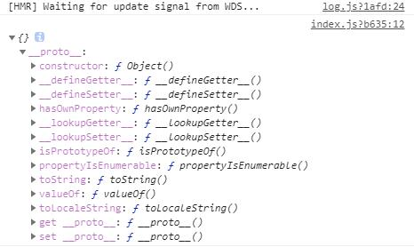

27 Shimming 的作用

#### new webpack.ProvidePlugin({$: 'jquery'}) 垫片

在webpack打包的过程中呢，我们往往要做一些代码上的兼容或者打包过程的兼容，举个例子来说：

之前我们使用过`@babel/polyfill`这样的一个工具，它解决的是什么样的问题呢？

我们打包生成的js代码运行在低版本浏览器上面的时候有的时候呢会因为低版本浏览器上不存在`Promise`这类的变量导致我们的代码没法运行，那为了解决打包生成代码中这样的一个问题我们就要借助`@babel/polyfill`这样的一个工具，在低版本浏览器上自动的帮我们去构建一些类似`Promise`这样的全局变量从而使我们的代码能够在这样低版本浏览器上运行。

那其实这就是一个webpack的垫片，它能够解决webpack打包过程中一些兼容性的问题，当然这种兼容性的问题不局限在浏览器的低版本或者高版本上面的这种兼容性问题，还有一些其它方面我们呢举几个例子来给大家讲解：

打开之前我们写的`lesson`写的项目：

index.js

在这里啊我们引入了`jquery`引入了`lodash`然后去在页面上创建了一个`div`标签里面显示`hello --- world`然后挂载到页面上

```
import _ from 'lodash';
import $ from 'jquery';

const dom = $('<div>')
dom.html(_.join(['hello','world'], ' --- '));
$('body').append(dom);
```

我们运行下看这个项目是否OK，`npm run dev`启动服务后它会帮我们启动一个浏览器页面，页面上展示出`hello --- world`没有任何的问题。

如果呢大家去使用这个webpack的时候你会发现有的时候会出现这样的一种情况，比如说啊在这里面我呢引入一个库比如叫`jquery.ui.js`这样的一个jquery库，这个库里面呢它写了一些代码：

jquery.ui.js

```
export function ui(){
    $('body').css('background', 'red');
}

```

然后呢我希望在我的业务代码里面去引入这个库：

index.js

```
import _ from 'lodash';
import $ from 'jquery';
import { ui } from './jquery.ui.js';

ui(); // 运行这个库

const dom = $('<div>')
dom.html(_.join(['hello','world'], ' --- '));
$('body').append(dom);

```

大家看下这个代码可以正确的执行吗？

实际上有些同学觉得可以正确的执行，其实它根本就不可能正确的执行，我们来运行一下试一下：

刷新浏览器`index.html`页面上就会报错：

```
Uncaught ReferenceError: $ is not defined
    at ui (jquery.ui.js?cf71:4)
    at eval (index.js?b635:6)
    at Module../src/index.js (main.js:887)
    at __webpack_require__ (main.js:785)
    at fn (main.js:151)
    at Object.0 (main.js:916)
    at __webpack_require__ (main.js:785)
    at checkDeferredModules (main.js:46)
    at main.js:861
    at main.js:864
```

`$ is not defined`，那`index.js`里用了`$`然后`jquery.ui.js`里也用了`$`，那到底时哪一个`$`找不到呢？

实际上时`jquery.ui.js`里面的这个`$`找不到，也就是我们我们引入的这个`jquery.ui.js`这个库里面它找不到`$`这个变量，你会说我不是在`index.js`里引入了这个`$`吗，那为什么在`jquery.ui.js`里面我找不到`$`呢？

原因很简单在webpack中我们说我们是基于模块打包的，模块里面的这些变量只能在模块这一个文件里面被使用，而换了一个文件你在想使用上一个文件里的这些变量那是根本就不可能的，通过这种形式我们可以保证模块和模块之间不会有任何的耦合这样的话出了问题我们直接到自己的模块里找问题就行了，不会因为一个模块
而影响到另外一个模块，所以它的变量是隔离的。

那也就是说如果在`jquery.ui.js`这个库里面你想使用`$`你就必须在上面去引入`jquery`：

jquery.ui.js

```
import $ from 'jquery';

export function ui(){
    $('body').css('background', 'green');
}

```

我们在来运行下就不会有问题了。

那我们说`juqery.ui.js`这个库实际上它不是我的业务代码，它是一个第三方的库是别人写的，所以你想去这个源码里去加这个`jquery`的引用实际上是不太现实的，我们现在把它写在`src`目录下实际的情况很有可能它是一个`npm`包，它是在`node_modules`里面的一个目录下，那你不可能去改`node_modules`下面的代码啊，那么就意味着你这个模块就用不了了吗？

那我就是想用这个库又该怎么去用呢，这个时候我们就可以借助一个`垫片`来解决这个问题。

打开`build`目录下`webpack.common.js`这个配置文件，我们引入一个webpack的模块，webpack自己提供了一个插件这个插件呢叫做`webpack.ProvidePlugin`：

webpack.common.js

```
const webpack = require("webpack");

module.exports = {
    plugins: [
      new webpack.ProvidePlugin({
         $: 'jquery'
      })
  ]
}
```

它的意思是什么？如果我的一个模块中使用了`$`这样的一个字符串我发现你又`$`这个字符串我就会在模块里自动的帮你引入`jquery`这个模块，然后呢把模块的名字叫做`$`。

大家听好了当我 发现你的一个模块里用了`$`这个字符串，`jquery.ui.js`里面我们用了`$`这个字符串就满足这个条件，然后我就会干什么呢在这个模块里面自动的帮你引入`jquery`。

修改`jquery.ui.js`这个文件：

```
// import $ from 'jquery';

export function ui(){
    $('body').css('background', 'red');
}

```

好我们这么配置后，试一下可不可以用了`npm run build`：

```
Built at: 2020-04-04 21:55:47
Asset       Size  Chunks                         Chunk Names
 index.html  314 bytes          [emitted]
main.b1b9077e740edd35a1fc.js   9.16 KiB       0  [emitted] [immutable]  main
vendors~main.7428a351eb120b27badf.chunk.js    871 KiB       1  [emitted] [immutable]  vendors~main
Entrypoint main = vendors~main.7428a351eb120b27badf.chunk.js main.b1b9077e740edd35a1fc.js
```

在浏览器上打开`index.html`这样就不会又任何的问题了，就不会在报`$ is not defined`，也就是通过`webpack.ProvidePlugin`我们就可以解决这样的一些问题。

如果你使用了一些版本比较老第三方的模块它里面用到了`jquery`或者 `lodash`而它的用法又不是现在我们`ES Module`的使用方式：

```
// 没有在上面 import
// import $ from 'jquery';

export function ui(){
    $('body').css('background', 'red');
}
```

如果你用webpack打包使用这样的模块的话或者这样的库的话它会报错的，为了解决这样的错误我们就可以用一个webpack的插件叫做`webpack.ProvidePlugin`这样
的一个插件，通过它的一个配置解决这样的问题，这个时候呢你其实就可以把这个插件理解成一个`垫片`通过它来解决之前我们存在的一些问题，当然这个插件的使用方式其实还有各种各样的花样，你呢可以做这样的一个测试：

在这里我用`$`这个符号，我还呢想使用一个`lodash`。

```
export function ui(){
    // _.join('green', '') 其实就相当于生成一个 blue 这样的一个字符串，让 body 的颜色变成 blue
    $('body').css('background', _.join(['blue'], ''));
}

```

那现在`_`肯定是用不了的，因为这种变量我们在上面并没有定义那想解决这种我们就可以在这里借助这个插件`webpack.ProvidePlugin`配置一下：

```
const webpack = require("webpack");

module.exports = {
    plugins: [
      new webpack.ProvidePlugin({
         $: 'jquery',
         _: 'lodash'
      })
  ]
}
```

这样就可以了，保存我们重新做一次打包`npm run build`：

```
Built at: 2020-04-04 22:20:47
Asset       Size  Chunks                         Chunk Names
index.html  314 bytes          [emitted]
main.a88217c59465bbf1628c.js   9.48 KiB       0  [emitted] [immutable]  main
vendors~main.688cd05c66d2f83345ec.chunk.js    871 KiB       1  [emitted] [immutable]  vendors~main
Entrypoint main = vendors~main.688cd05c66d2f83345ec.chunk.js main.a88217c59465bbf1628c.js
```

再来看页面就变成蓝色了。

好我呢还可以这么去写，你就想用`join`这个方法所以呢我想把`lodash`里的`join`换一个名字把它起名叫做`_join`直接来用这个`_join`，那如果你想这么去写它肯定会报错的，这么让它不报错呢？

我们在这定义一个`_join`让它后面跟一个数组：

jquery.ui.js

```
export function ui(){
    $('body').css('background', _join(['blue'], ''));
}
```

webpack.common.js

```
    new webpack.ProvidePlugin({
       $: 'jquery',
       _: 'lodash',
       // _join 等于 lodash里面的join方法
       _join: ['lodash', 'join']
    })
```

_join 等于 lodash里面的join方法，所以在打包的时候我发现你用了` _join `那么我就会把`lodash`下面的`join`打包放到你对应的模块里面去，同时给它起名叫做` _join ` ，那这样的配置之后呢你呢再在这里面使用` _join `这个方法
就不会报错了。

---

#### imports-loader 改变 js 模块中 this 的指向

好接着我们在讲一些`垫片`的使用方法，我们下面写一个功能：

index.js

```
console.log( this );
```

我们说现在啊我们的入口文件是一个模块是`index.js`，我在这里尝试打印`this`看一下`this`指向的是谁：

`npm run dev`

运行`npm run dev`后会自动在浏览器上打开`index.html`，我们打开控制台大家可以看到`this`指向的是一个对象，这个对象里面呢会有一些方法：



实际上这个this指向的是这个模块它自身，但是有的时候我希望在写代码的时候这个`this`指向的是`window`，那我们来看看它到底等不等于`window`：

```
console.log( this === window );
```

保存，在浏览器的控制台上输出的是`false`，你会发现一个模块里的`this`默认它永远指向的是模块自身而不是`window`这个全局变量，那我现在就想让你指向全局变量`window`，有没有方法呢？

有，我们可以借助一些`loader`来解决这个问题，如果你想让你的每一个js模块它的this都指向`window`这么做呢？

我们在这来安装一个插件叫做`imports-loader`

```
cnpm install imports-loader --save-dev
```

安装好`imports-loader`后我们在对webpack做一些配置，我们打开webpack.common.js这里面呢我们可以看到只要我们遇到js文件的引入我们就使用了一个`babel-loader`，那其实我们在这里啊可以在用一下我们刚才安装的`imports-loader`来对this的指向做一个变更：

webpack.common.js

```
module.exports = {
    module: {
      {
        test: /\.js$/,
        exclude: /node_modules/,
        use: [{loader: 'babel-loader'},{loader: 'imports-loader?this=>window'}]
        // loader: "babel-loader"
      }
    }
}
```

这么写就行了如果我加载一个js文件的时候首先会走`imports-loader`它会把这个js文件（也就是js模块）里面的this改成window，这就是它的写法大家照着这么写就行了然后在交给`babel-loader`做js文件的编译，`babel-loader`里面呢会使用这个`@babel/preset-env`对它的一些es6的语法做解析同时还支持`@babel/plugin-syntax-dynamic-import`动态引入的这种语法。

那么当我们配置了`imports-loader`之后我们在重新运行打包命令`npm run dev`：


点开浏览器控制台大家可以看到打印出的就是`true`了，说明现在我们模块里面的this就被更改成了window，好这样的话呢我们在模块里面在使用this的话直接就指向window了。

那这样其实也是它去改变了webpack打包中一些默认的特性，那this以前指向模块本身现在我把this做了一个变更，那实现这种变更实际上我们也可以
使用一个插件或者使用一个loader叫做`imports-loader`，那这种形式实际上也是去修改webpack一些默认的行为或者说实现一些webpack原始打包实现不了的效果，那这种行为都叫做`Shimming`垫片的行为。

那`Shimming`这个概念很宽泛它涉及到的东西也非常的多有可能大家在未来呢会遇到各种各样你想不到的这些需要你做`Shimiming`的场景，根据不同的场景大家对应的去找不同的解决方法就可以了。

#### 作业

最后呢我来给大家留一个作业：

我们打开[webpack](https://webpack.docschina.org/concepts/)的官方网站进入到guides[[指南](https://webpack.docschina.org/guides/)]这个目录，这个目录下就是这个课程我主要给大家讲的内容，这里涵盖了webpack的方方面面。

那么现在[shimming](https://webpack.docschina.org/guides/shimming/)之前的所有内容其实我都给大家讲解过了，唯一一个没有讲到的内容就是`author-libraries`[[创建 library](https://webpack.docschina.org/guides/author-libraries/)]也就是处理库代码的打包这块的内容我们会放在下一章给大家讲解这块的内容
，之前所有的内容其实都给大家讲解过了那我建议大家呢自己来阅读一下这块的文档。
