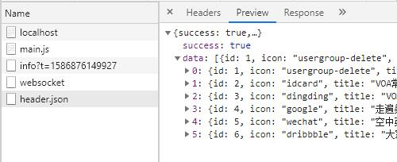

使用 WebpackDevServer 实现请求转发

同学们大家好，这节课我在来给大家讲一个在日常开发环境中我们经常会用到的一个 webpack 对应的配置，那这块呢它的内容就是：如何使用 WebpackDevServer 来实现开发环境下请求的转发。

我们给大家举一个例子：

先来看一下我们要使用的 lesson 项目中 webpack 的配置：

```
src
 |-index.js
.babelrc
.browserslistrc
index.html
package.json
postcss.config.js
webpack.config.js
```

webpack.config.js

```
// 引入 html-webpack-plugin 插件
const webpack = require('webpack')
var HtmlWebpackPlugin = require('html-webpack-plugin');
const { CleanWebpackPlugin } = require('clean-webpack-plugin');
const path = require('path');

module.exports = {
  mode: 'development',
  devtool: 'cheap-module-eval-source-map',
  // development cheap-module-eval-source-map
  // production cheap-module-source-map
  entry: {
    main: ['./src/index.js']
  },
  output: {
    filename: '[name].js',
    path: path.resolve(__dirname, 'dist')
  },
  devServer: {
    contentBase: './dist',
    open: true,
    port: 8080
    /* proxy: {
      '/api': 'http://localhost:3000'
    } */
  },
  module: {
    rules: [
      {
        test: /\.js$/,
        exclude: /node_modules/,
        loader: 'babel-loader',
        options: {
          presets: [['@babel/preset-env', {
            useBuiltIns: 'usage',
            // 这个 corejs 一定要配置，Babel在7.4.0以后想要安装corejs这个核心库
            corejs: {
              version: 3
            }
          }]]
        }
      },
      {
        test: /\.(jpg|png|gif|jpeg)$/,
        use: {
          loader: 'url-loader',
          options: {
            name: '[name]-[hash:8].[ext]',
            outputPath: 'images/',
            // 字节
            limit: 10240
          }
        }
      },
      {
        test: /\.scss$/,
        use: [
          'style-loader',
          // "css-loader",
          {
            loader: 'css-loader',
            options: {
              importLoaders: 2,
              modules: true
            }
          },
          'sass-loader',
          'postcss-loader'
        ]
      },
      {
        test: /\.(woff|eot|ttf|otf|svg)$/,
        loader: 'file-loader',
        options: {
          name: '[name].[hash:8].[ext]',
          outputPath: 'fonts/'
        }
      },
      {
        test: /\.css$/,
        use: [
          'style-loader',
          'css-loader',
          'postcss-loader'
        ]
      }
    ]
  },
  plugins: [
    new HtmlWebpackPlugin({
      template: './index.html'
    }),
    new CleanWebpackPlugin({
      verbose: true, // 在命令窗口中打印`clean-webpack-plugin`日志
      cleanOnceBeforeBuildPatterns: [path.resolve(__dirname, 'dist')] // 清除的文件/文件夹
    }),
    new webpack.HotModuleReplacementPlugin()
  ]
};

```

实际上呢在这个 lesson 项目里面只有一个 webpack 的配置文件叫做`webpack.config.js`，它是一个开发环境下的配置文件，入口`entry`是`./src/index.js`，那这里面有一个`devServer`也就是 WebpackDevServer 相关的一个配置，好下面是对一些模块的解析规则可以处理`js`文件、`jpg`文件、字体文件、`scss`文件还有`css`文件。

下面使用了一个`HtmlWebpackPlugin`，然后这是一个`HotModuleReplacementPlugin`这样的一个插件，没有太多的配置项。

好接着呢我们来看有一个`postcss.config.js`这块我们也不用去管，它是使用了一个`autoprefixer`和`postcss-import`，这块我们也不用去管：

postcss.config.js

```
module.exports = {
  plugins: [
    require('postcss-import'),
    require('autoprefixer')
  ]
}

```

.babelrc 里面我们可以看一下，这里面我们用了一个`@babel/preset-env`里面呢使用了一个`"useBuiltIns": "usage"`这样的话呢我们就可以去写`es6`的代码最终会编译成`es5`的代码。

.babelrc

```
{
  "presets": [
    [
      "@babel/preset-env",
      {
        "useBuiltIns": "usage",
        // 这个 corejs 一定要配置，Babel在7.4.0以后想要安装corejs这个核心库
        "corejs": {
          "version": 3
        },
        "targets": {
          "chrome": "67"
        }
      }
    ]
  ]
}

```

我们打开`src`目录点开`index.js`，在这里面我们写了一段代码，第一行我们引入了一段`import '@babel/polyfill';`，但实际上学到现在大家应该知道当我们在`.babelrc`里面配置了`"useBuiltIns": "usage"`这样的一个属性并且它的值是`usage`的时候，那么实际上我可以不去引入这个`@babel/polyfill`它会自动的帮我们去加载需要加载的一些`polyfill`的内容。


index.js

```
// 配置了"useBuiltIns": "usage" 后在业务代码里不需要在手动引入
// import '@babel/polyfill';

```

`index.js` 我们先这样，我们先启动下我们的项目`npm run start`：

我们先打开 package.json 来看一下，我们在运行`npm run start`的时候实际上启动的是`webpack-dev-server`它会帮你启动一个服务器，让你快速的进行项目的开发。

```
C:\Users\nickname\Desktop\lesson>npm run start

> webpack-demo@1.0.0 start C:\Users\nickname\Desktop\lesson
> webpack-dev-server


C:\Users\nickname\Desktop\lesson>"node"  "C:\Users\nickname\Desktop\lesson\node_modules\.bin\\..\_webpack-dev-server@3.10.3@webpack-dev-server\bin\webpack-dev-server.js"
i ｢wds｣: Project is running at http://localhost:8080/
i ｢wds｣: webpack output is served from /
i ｢wds｣: Content not from webpack is served from ./dist
i ｢wdm｣: Hash: af26c5493256e231b7d3
Version: webpack 4.42.1
```

好服务器正确运行之后呢，我们在写一个项目的时候经常要去发一些`ajax`请求，所以呢这个`ajax`请求的发送是不可避免的在一个项目中要出现的，那我们来写下这个`ajax`我们要怎么去发送这样的请求。

首先如果你要去发送`ajax`请求，在比较先进的前端框架里面一般我们会去使用一个第三方的模块叫做`axios`：

```
cnpm i axios -S
```

安装好后，我们重启下我们的工程`npm run start`：

现在呢我们这里啊实际上代码里面就可以去引入这个发送`ajax`的模块了：

index.js

```
// import '@babel/polyfill';
import _join from "lodash/join";
import axios from "axios";

function component() {
  const element = document.createElement("div");
  element.innerHTML = _join(["Hello", "webpack"], " ");

  return element;
}

document.body.appendChild(component());

const getData = () => {
  axios.get("http://www.dell-lee.com/react/api/header.json").then(res => {
    console.log(res);
  });
};

setTimeout(() => {
  getData()
}, 1000)


```

我在`getData`方法里写一个`ajax`请求的发送，我发送一个`get`请求。

这样的话呢，当页面展示出来后，定时器过了1秒钟后，我就会去执行`getData`函数然后`axios.get`就会去请求远程接口上的数据，拿到数据后我会把结果打印出来，保存代码后我们到我们刚才的页面上来看一下啊，浏览器打开到`index.html`这个页面上然后打开控制台，大家可以看到这个时候啊它已经把接口请求的结果返回回来了：


聪明点的同学呢肯定会有这样的疑问，我是在`http://localhost/`这个域名下去请求一个另外一个域名的接口，正常应该跨域啊为什么现在不跨域不报错呢，这是因为在我的这台远程服务器上对跨域做了一些配置我允许你跨域发送请求，好所以你能正常的拿到结果。

但是接下来我们要继续讲我们今天课程的一些核心内容了，我们来看实际上在我们做开发的时候我们前端的代码有可能啊是在一个开发环境下去运行的，也有可能在一个线上
环境去运行的，开发环境请求的后端接口和线上环境请求的后端接口有可能是不一致的，那比如说我前后端在开发联调的过程中那我现在请求的接口呢可能是后端的一台测试
服务器，而当线上了呢我请求的地址呢就是一个后端的线上服务器，所以如果你在这把这个域名写死了的话：

```
  axios.get("http://www.dell-lee.com/react/api/header.json").then(res => {
    console.log(res);
  });
```

那么你请求的永远都是线上的这台服务器就会有问题，所以一般来说我们去做`ajax`请求在前端里面去请求接口的时候不会去用这种 绝对路径 的形式，而是会产用一种 相对路径 的形式：

```
  axios.get("/react/api/header.json").then(res => {
    console.log(res);
  });
```

那如果我这么去写一个路径大家想接口你能获取得到吗？

保存刷新浏览器，我们看


它肯定会报`http://localhost:8080/react/api/header.json` localhost这个域名的8080端口下根本就没有这个接口，那怎么办？

有的同学会想之前在我的其它的课程里面我讲过一个工具，叫做什么呢，叫做`charles`或者有些同学也可能听说过`fiddler`这样的一些工具，借助这些工具呢我们可以在本地搭建一个服务器或者说代理服务器，然后通过代理服务器我们把这个`/react/api/header.json`地址的请求在做一次转发，你可以用`charles`或者`fiddler`这样的工具帮你去做转发，但是现在我们使用了 webpack-dev-server 这样的一个工具进行本地项目的开发，所以有更简单的一些配置方式。

##### proxy

我们可以[->webpack的官方网站](https://webpack.docschina.org/configuration/dev-server/)在configuration[配置]页面中找到`开发中 server(devServer)`
在展开的列表中我们找到 [->devServer.proxy](https://webpack.docschina.org/configuration/dev-server/#devserver-proxy) 选项。

通过这个`devServer.proxy`配置想我们就可以很方便的进行本地接口的调试，我们来看它是一个什么的意思。

在这里我们自己来配置一下`devServer.proxy`对应的内容：

进入到`webpack.common.js`找到`devServer`里面我们来写一个`proxy`这样的配置项：

webpack.common.js

```
module.exports = {
    devServer: {
        contentBase: "./dist",
        open: true,
        port: 8080,
        hot: true,
        hotOnly: true
        proxy: {

        }
    }
}
```

好现在呢我们在`index.js`中是写了一个相对的路径：

index.js

```
  axios.get("/react/api/header.json").then(res => {
    console.log(res);
  });
```


我请求的是`/react/api`下面的`header.json`，但是呢实际上你现在请求的是哪里呢，你请求的是`localhost`下面的`/react/api`下面的`header.json`，但是我想法是什么呢，我的想法是如果在开发环境下我请求的是这个接口你能不能帮我做一次代理去请求`www.dell-lee.com`这个接口把数据拿回来返回给我，我们通过`proxy`这样的配置就可以完全做到这一点。

在 webpack.common.js 这里面我们配置`proxy`，怎么配呢，在这里我这样去配：

当你请求`/react`这个路径下面的`/api`这个路径下的所有内容的时候，我都可以把它代理到哪台服务器上呢，代理到`http://www.dell-lee.com`这台服务器上。

```
    devServer: {
        contentBase: "./dist",
        open: true,
        port: 8080,
        hot: true,
        hotOnly: true
        proxy: {
          '/react/api': 'http://www.dell-lee.com'
        }
    }
```

这样的话我们保存一下，当然大家记得当我们改了 webpack 的配置内容之后我们一定要重启一下 webpack 的服务：

```
C:\Users\nickname\Desktop\lesson>npm run start

> webpack-demo@1.0.0 start C:\Users\nickname\Desktop\lesson
> webpack-dev-server


C:\Users\nickname\Desktop\lesson>"node"  "C:\Users\nickname\Desktop\lesson\node_modules\.bin\\..\_webpack-dev-server@3.10.3@webpack-dev-server\bin\webpack-dev-server.js"
i ｢wds｣: Project is running at http://localhost:8080/
i ｢wds｣: webpack output is served from /
i ｢wds｣: Content not from webpack is served from ./dist
i ｢wdm｣: wait until bundle finished: /
i ｢wdm｣: Hash: e36d4b89cf6299cd282f
Version: webpack 4.42.1
Time: 3023ms
```

好打开`index.html`刷新浏览器，打开控制台大家来看，我点击`Network`面板刷新一次页面：


大家可以看到现在我请求的还是`http://localhost:8080/react/api/header.json`正常的话我的`localhost:8080`端口下这个接口肯定是不存在的，但是我们查看一下数据：



它已经返回了我`http://www.dell-lee.com`这个接口下的所有内容了，那为什么会返回这个内容呢，就是因为我们配置了一个`proxy`这样的配置项，有了这个配置项当我们在代码里面去请求已`/react/api`开头的这样的接口的时候，`proxy`
就知道它要走：

```
'/react/api': 'http://www.dell-lee.com'
```

这条规则，那它就会把你请求这个路径'/react/api'下的所有请求转发到`http://www.dell-lee.com` 这个服务器下，那它回到`http://www.dell-lee.com`下拿到对应接口的内容，通过你`localhost:8080`下面的`/react/api`这样的一个接口在
返回给你，中间做了一层数据的转发，那有了它我们再去做开发环境的这种数据的联调就会变的非常的简单的了，所以这个东西呢在我们日常的开发环境下做 webpack 的配置之中呢是非常常见的。

当然它的配置呢不限于如此，我们还可以做一些复杂的配置，我举个例子来说啊：

在浏览器上点开`http://www.dell-lee.com/react/api/header.json`这个接口，实际上呢我还有一个`http://www.dell-lee.com/react/api/demo.json`这样的一个接口，它返回的内容啊就是这样一个简单的内容：

（请求`http://www.dell-lee.com/react/api/demo.json`返回的数据）

```
{
  "success": true
}
```

##### pathRewrite

那在实际的开发环境中呢，我们经常会遇到这样的一个场景：

那后端说呢，现在这个`header.json`这个接口还暂时没有办法提供给你使用，但是呢你可以暂时先用一下我`demo.json`这里面的数据，这里我给你做了一个假数据你可以先用着。

好所以对于我们前端来说，我们就知道了实际上我们在这里：

```
const getData = () => {
  axios.get("/react/api/header.json").then(res => {
    console.log(res);
  });
};
```

最终要请求的接口是`header.json`，但是`header.json`现在后端说没法用，它提供给你另外一个接口先临时使用，那有的同学说我这里直接把它改成`demo.json`不就可以了：

```
const getData = () => {
  axios.get("/react/api/demo.json").then(res => {
    console.log(res);
  });
};
```

你这么改后端如果后来把`header.json`改好了之后你还要回过头来在把它替换成：

```
const getData = () => {
  axios.get("/react/api/header.json").then(res => {
    console.log(res);
  });
};
```

一旦你忘记了代码上线了就会有问题，所以一般来说不要在这里随便去改这种测试的接口，那它未来上线就叫`header.json`这里我们始终都把它写成`header.json`
，而在这个 webpack 的配置里面我们可以完成这个`header.json`和`demo.json`之间的一个转换

我们来看在 webpack.config.js 里面可以怎么进行配置：

webpack.config.js

```
  devServer: {
    contentBase: "./dist",
    open: true,
    port: 8080,
    hot: true,
    hotOnly: true,
    proxy: {
      // '/react/api': 'http://www.dell-lee.com'
      '/react/api': {
        target: 'http://www.dell-lee.com',
        pathRewrite: {
          'header.json': 'demo.json'
        }
      }
    }
  }
```

`'/react/api'` 不变，我们这里可以变成一个对象配置一个`target`属性，意思就是啊跟刚才我们写的那个字符串没有差异（意思就是如果你请求这个`'/react/api'`路径下的地址，我就帮你代理到`www.dell-lee.com`下面），

好接着呢我们可以在写第二个参数，叫做`pathRewrite`在这里面可以跟一个对象,这里我们刚才看到了假设我要请求`header.json`实际上后端说你不能用`header.json`你先临时用`demo.json`里面的数据，我们就可以这么去写`'header.json': 'demo.json'`当我们做了这个配置它的意思就是：一个用户如果请求了`'/react'`下面这个`/api`路径下的地址的时候首先它会到`www.dell-lee.com`下帮你去拿数据，但拿数据的时候它还有一些规则，如果你去拿`header.json`的数据的时候实际上我间接的不是帮你拿`header.json`而是帮你拿`demo.json`的数据返回给你，所以这样的话你在你的`ajax`请求写的这个接口代码上面就不用去写`demo.json`
而是通过`webpackDevServer`的`proxy`这块的配置项帮你去间接的拿到`demo.json`这块的内容返回给你效果是一样，同样你的源代码就不需要变更了。

做了这样的一个配置之后，我们保存重启一下我们的服务器`npm run start`：

```
C:\Users\nickname\Desktop\lesson>npm run start

> webpack-demo@1.0.0 start C:\Users\nickname\Desktop\lesson
> webpack-dev-server


C:\Users\nickname\Desktop\lesson>"node"  "C:\Users\nickname\Desktop\lesson\node_modules\.bin\\..\_webpack-dev-server@3.10.3@webpack-dev-server\bin\webpack-dev-server.js"
i ｢wds｣: Project is running at http://localhost:8080/
i ｢wds｣: webpack output is served from /
i ｢wds｣: Content not from webpack is served from ./dist
i ｢wdm｣: wait until bundle finished: /
i ｢wdm｣: Hash: 7df27883d84148e77162
```

然后我们来看一下我们的这个请求，大家看我现在 还是请求的是`header.json`，但是拿到的返回结果就一个`success: true`，它的结果实际上是`demo.json`的结果，这样的话就实现了我们想要的一个结果，


我们呢源代码里没有做任何的变更，通过这个`webpack.config.js`里面的`devServer.proxy`做了一个转发，做了一个`pathRewrite`这样的话就可以拿到`demo.json`里面的内容了这样做最大的好处就是拿一旦后端说行了现在我的这个`header.json`的接口已经写好了，那么你不需要修改你的代码你只需要在`pathRewrite`注释掉。

需要大家注意的是什么呢，我们说这个`proxy`是谁的`proxy`，它实际上是`webpackDevServer`的`proxy`这就意味着只有在开发环境下我们对`proxy`的配置才会生效，因为只有在开发环境下我们才会使用`webpackDevServer`而真正代码如果进行了打包要上线的时候拿线上压根就不存在这个`webpackDevServer`那你做这些配置
根本就不会生效的，所以线上的代码如果你去请求`/react/api/header.json`它请求的就是相对于线上的这个服务器地址的`/react/api/header.json`它中间不会有任何的请求转发过程，这点大家要注意。

所以这个`proxy`的配置实际上就是方便我们在开发的过程中去做接口转发的而线上的这些地址应该在我们写代码的时候就写好在过程中不会有任何的转发。

那回过头来我们继续说`proxy`它的配置项还有很多很多，我们可以简单给大家说一说：

##### secure

有的时候你呢要去做这个请求转发的时候啊转发到的这个网址不是一个`http`的网址可能是一个`https`的网址，这个时候呢你要在配置一个`secure`把它配置成`false`：

```
proxy: {
  // '/react/api': 'http://www.dell-lee.com'
  '/react/api': {
    target: 'http://www.dell-lee.com',
    secure: false,
    pathRewrite: {
      'header.json': 'demo.json'
    }
  }
}
```

这样的话才能够实现对`https`网址请求的一个转发。

##### bypass

其实在这里呢我们还可以做一些拦截，这个`bypass`呢起的就是一个拦截的作用，我们可以给大家简单的说一下：

```
proxy: {
  // '/react/api': 'http://www.dell-lee.com'
  '/react/api': {
    target: 'http://www.dell-lee.com',
    secure: false,
    bypass: function(req, res, proxyOptions) {
      if (req.headers.accept.indexOf("html") !== -1) {
        console.log("Skipping proxy for browser request.");
        return "/index.html";
        // return false; 不走代理
      }
    },
    pathRewrite: {
      'header.json': 'demo.json'
    }
  }
}
```

它的意思是，正常来说我去请求`/react/api`下面所有内容的时候都应该做这种代理，但是我分析出如果你请求要接收的内容是一个`html`的话也就是你请求的地址是一个`html`相应的地址的话我直接就给你返回`index.html`这个路径下的内容也就是什么呢，如果遇到你请求`html`的情况我呢就跳过这种转发的请求直接就给你返回当前这个项目根路径下`index.html`这个路径下应该给你返回的内容，当然这块呢你也可以返回一个`false`，它的意思就是如果你请求一个`html`的话我直接就跳过这次转发该给你返回什么就给你返回什么就不会走这个代理了，好`bypass`大概就是这样一个意思。

##### context

```
proxy: [{
  context: ["/auth", "/api"],
  target: "http://localhost:3000",
}]
```

这里假设我有多个路径，现在大家可以看到我这里只有一个路径，也就是当你访问`/react/api`这个路径下的时候我要去走这种转发的规则：

```
proxy: {
  // '/react/api': 'http://www.dell-lee.com'
  '/react/api': {
    target: 'http://www.dell-lee.com',
    secure: false,
    pathRewrite: {
      'header.json': 'demo.json'
    }
  }
}
```

如果你有多个路径怎么办呢？

大家可以把多个路径放在`context`里面去管理，那它意思就是：你访问`/auth`或者`/api`这个路径的时候我都会去帮你做代理，代理到`http://localhost:3000`这个域名下。

##### [devServer.index](https://webpack.js.org/configuration/dev-server/#devserverproxy)

这个`index`要给大家讲解下，如果啊你这里：

```
devServer: {
 index: false,
 proxy: {
  // 根目录
  '/': {
    target: 'http://www.dell-lee.com',
    secure: false,
    pathRewrite: {
      'header.json': 'demo.json'
    }
  }
 }
}

```

直接去代理这个根目录，这样呢实际上是不行的，因为`webpack-dev-server`在你做`proxy`配置的时候你对这个`/`根目录做这个代理转发它默认是不支持的，如果你想对根目录做转发，怎么办？

你呢需要把`index`这个值设置成一个 false ， 或者呢设置成一个 '' 空，这么写之后下面的请求才会生效。

##### changeOrigin: true

这个`changeOrigin`也是我们经常会用到的一个配置项，那`changeOrigin: true`一般产生于一个什么样的情况呢？

大家呢如果经常的去做代理转发的时候你会发现，有一些网站啊对`changeOrigin`
做了一个限制，它去防止这种外部的爬虫爬它网站的内容，所有呢有的时候如果你直接去做这种`proxy`的配置，然后呢去代理到比如说`dell-lee`这个网站上你会发现拿不到接口的内容，那是因为它那边对`changeOrigin`做了一个限制，所以怎么能解决这个限制的问题呢，实际上你在这下面配置一个`changeOrigin: true`就可以了，这样的话呢就可以突破它的这个对`changeOrigin`的一个限制。

所以我建议大家你去做代理转发的时候，始终都把这个`changeOrigin`加上就可以了


好实际上对于`webpackDevServer`它的`proxy`配置呢它的配置项还有非常多的内容。

如果我们的项目是通过 webpack 这种打包工具进行配置的话，使用了 webpackDevServer 这种服务器进行开发环境的搭建的话，那么我们完全可以用`proxy`来进行请求的转发。

这节课呢实际上我就给大家讲了一个知识点就是如何去配置 webpackDevServer 下的`proxy` 这个配置项。

那这里我们在回顾下：

- target 指的是请求代理，代理到哪个网址
- secure 指的是可以对 https 的请求地址生效
- pathRewrite 指的是一些路径的重写
- changeOrigin 可以帮助我们请求里面的这个选项使我们这个代理可以支持更多的这种域名下的
请求的访问
- headers 我们可以在请求头里面去自己自定义一些东西，从而呢模拟一些登录的行为。

```
proxy: {
  // '/react/api': 'http://www.dell-lee.com'
  "/react/api": {
    target: "http://www.dell-lee.com",
    secure: false,
    changeOrigin: true,
    pathRewrite: {
      "header.json": "demo.json"
    },
    /* headers: {
      host: "www.dell-lee.com",
      cookie: ""
    } */
  }
}
```

好还有一个重点就是：我们说 `proxy` 只能在`webpackDevServer` 这个环境下生效，也就是呢只有我们在使用`webpack-dev-server`在开发环境下才能去使用这种`proxy`的配置项，那真正线上的代码因为它没有`webpack-dev-server`这个东西所以呢是根本就不会生效的，这个知识点大家要掌握掉，那么之后呢大家如果使用 webpack 配置你的项目在做开发环境的接口的代理的时候就可以使用`proxy`帮助你完成这样的功能了。

