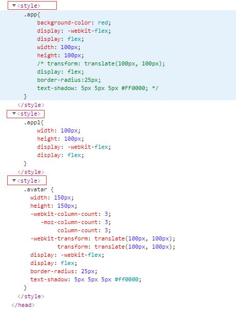
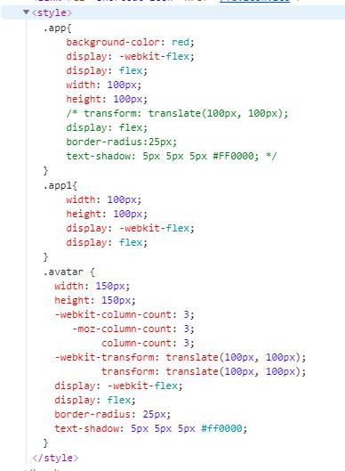

59-1 style-loader 将多个style的css内容合并到一个style标签内，防止index.html上style标签太多

[->style-loader](https://webpack.js.org/loaders/style-loader/#singletonstyletag)

[->webpack 系列：10 分钟搞定 style-loader](https://segmentfault.com/a/1190000020611324?utm_source=tag-newest)

#### 场景：

我们在项目开发时会写很多的`css` `.scss` `.less`这样的样式文件，那么在经过 webpack 打包构建时通过 style-loader 来处理最终会在 index.html 页面上的 header 标签内生成很多的 <style>...</style>  标签

（IE9 对页面上允许的 style 标签数量有严格的限制。你可以使用 singleton 选项来启用或禁用它。）

那怎么将很多的 style 标签中的 样式都合并到一个 style 标签里面呢？

#### 解决办法：

我们可以使用 style-loader 中的 `injectType`属性。

默认情况下（injectType: 'styleTag'），style-loader 每一次处理引入的样式文件都会在 DOM 上创建一个 <style> 标签

注意：

低版本的 style-loader 配置的是 singleton: true，如果你安装的版本在配置了 singleton: true 后打包报错，那么可以使用 injectType: 'singletonStyleTag'

```
module.exports = {
  module: {
    rules: [
      {
        test: /\.css$/,
        use: [
          // 'style-loader', // 把 css 样式内容内联到 style 标签内
          {
            loader: 'style-loader',
            options: {
              // singleton: true // 处理为单个style标签（低版本）
              injectType: 'singletonStyleTag' // 处理为单个style标签
            }
          },
          // 'css-loader', // 处理 .css 文件
          {
            loader: 'css-loader'
          },
          'postcss-loader' // 构建时调用 autoprefixer 自动添加浏览器厂商前缀 （webkit、moz、ms）
        ],
        // 例如 element-ui 样式库会有主题 css文件存在于 node_modules 中，所以 css 文件的 loader 不应该加入 include 和 exclude
        // import 'element-ui/lib/theme-chalk/index.css' 这个主题样式是在 node_modules 中的
        // include: [resolve('src'), resolve('test')]
        // exclude: /node_modules/
      },
    ]
  }
}
```

这样的配置在 sass-loader和less-loader中同样适用。

没有 配置 injectType: 'singletonStyleTag'：




配置了 injectType: 'singletonStyleTag'：


