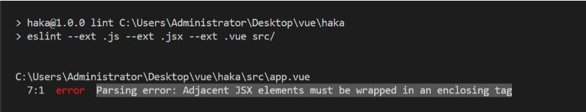

68 .vue 模板文件 eslint 对 script 标签提示（Adjacent JSX elements must be wrapped in an enclosing tag）错误解决

#### 问题如下图：



#### 解决方法

在.eslintrc添加"extends": [“standard”, “plugin:vue/recommended”],

需要先安装：

```
npm i eslint-plugin-vue -D
```

.eslintrc

```
extends: [
    // https://github.com/standard/standard/blob/master/docs/RULES-en.md
    "plugin:vue/strongly-recommended",
    "standard"
  ],
  plugins: ["html", "vue"],
```

